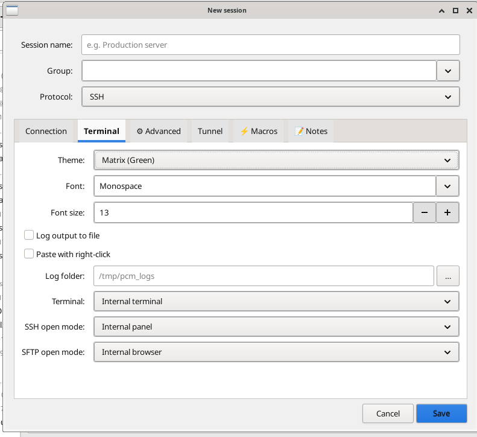
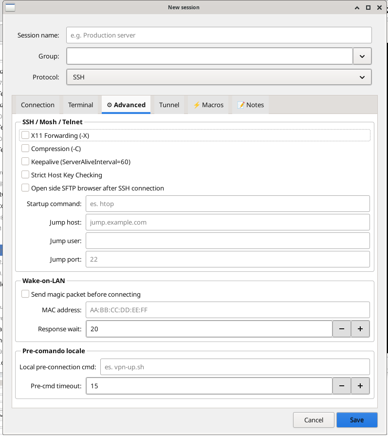
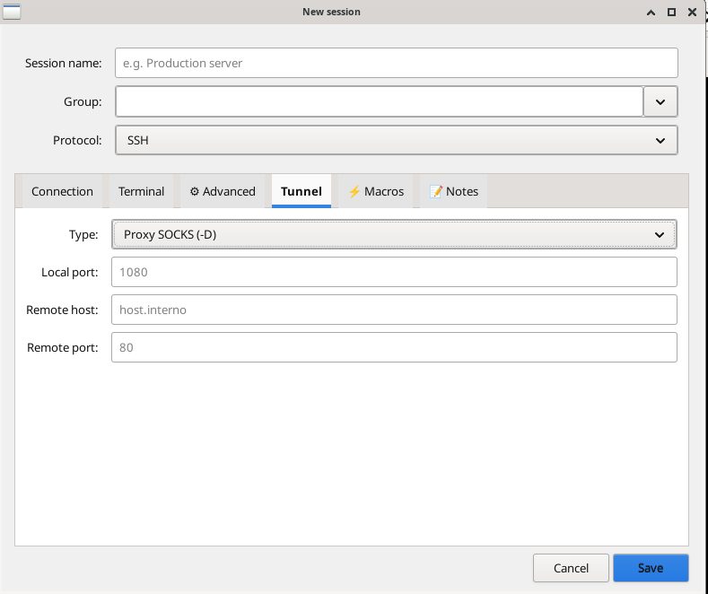
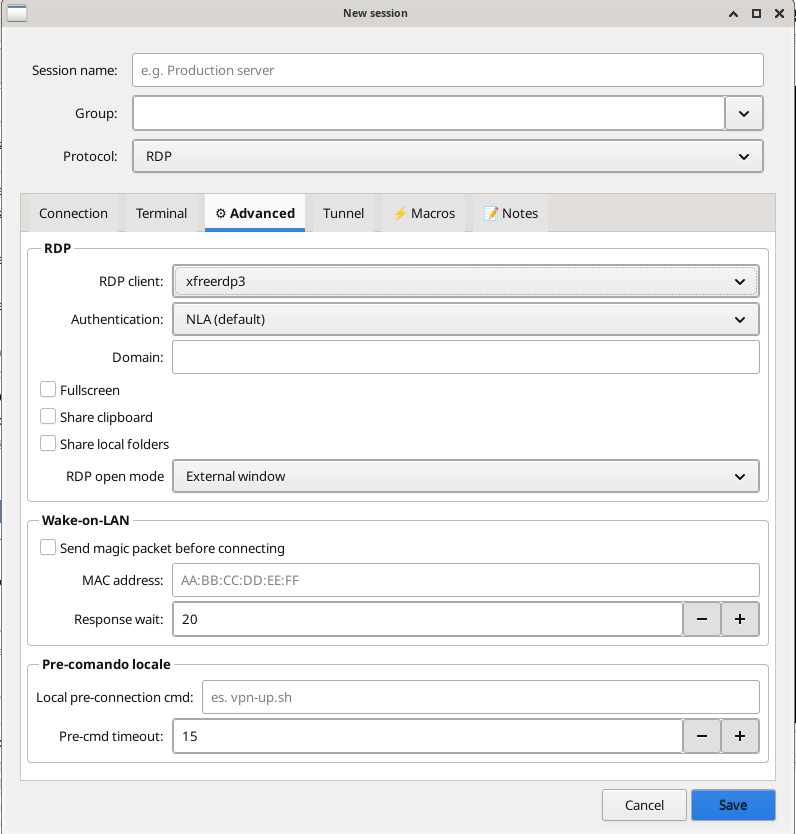
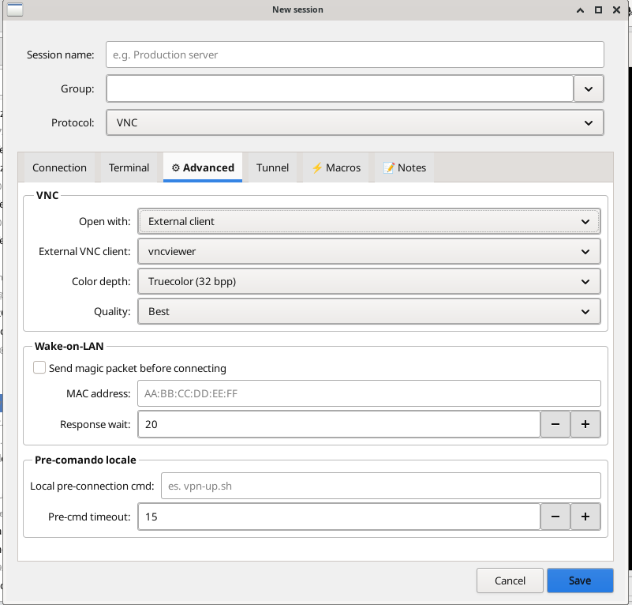

# PCM — Python Connection Manager

  [](EUPL-1.2%20EN.txt)
  [](https://www.python.org/)
  [](https://www.paypal.com/cgi-bin/webscr?cmd=_donations&business=azanzani@gmail.com&item_name=Support+PCM+Project)

> Gestore grafico di connessioni remote per Linux, ispirato a MobaXterm.
> Scritto in Python, disponibile in due versioni: **PyQt6** e **GTK3**.

---


*Schermata principale — sidebar sessioni con tutti i protocolli, quick connect, schermata di benvenuto*

---

## Versioni disponibili

| Versione | Cartella | Framework | Terminale | Wayland |
|---|---|---|---|---|
| Originale | [`pyqt6/`](./pyqt6/) | PyQt6 | xterm | XWayland richiesto |
| GTK3 | [`gtk3/`](./gtk3/) | GTK3 (PyGObject) | VTE nativo | ✅ Nativo |


---

## Protocolli supportati

**SSH · SFTP · FTP/FTPS · RDP · VNC · Telnet · Mosh · Seriale · SSH Tunnel**

---

## Funzionalità principali

- 🖥 **Sessioni organizzate per gruppo** con ricerca istantanea
- ⚡ **Quick Connect** dalla toolbar — `utente@host:porta`
- 🔐 **Cifratura credenziali** AES-256 (PBKDF2-SHA256, 480k iterazioni)
- 📂 **Browser FTP/SFTP** dual-pane stile WinSCP con coda trasferimenti
- 🔀 **Tunnel SSH** gestiti graficamente (SOCKS, locale, remoto)
- 💻 **Split terminale** verticale/orizzontale — più sessioni in parallelo
- ⚡ **Macro per sessione** e **Multi-exec** su più server contemporaneamente
- 🌐 **Wake-on-LAN** integrato prima della connessione
- 📥 **Import** da Remmina e Remote Desktop Manager
- 🔑 **Gestione chiavi SSH**: genera, copia, mostra pubblica
- 🖧 **Server FTP locale** integrato (pyftpdlib)
- 🌍 **5 lingue**: Italiano · English · Deutsch · Français · Español

---

## Screenshot

| | |
|---|---|
|  |  |
| *Connessione SSH — gestione chiavi (genera, copia pubblica, mostra)* | *Opzioni terminale — tema, font, log, paste con tasto destro* |
|  |  |
| *SSH Avanzato — Wake-on-LAN, jump host, startup command, pre-cmd VPN* | *Tunnel SSH — SOCKS proxy, forwarding porte locale/remoto* |
|  |  |
| *RDP — xfreerdp3, autenticazione NLA, fullscreen, clipboard, cartelle* | *VNC — client esterno, profondità colore, qualità* |


*Browser SFTP/FTP dual-pane — navigazione locale e remota con coda trasferimenti*

---

## Installazione rapida (GTK3)

```bash
git clone https://github.com/buzzqw/Python_Connection_Manager.git
cd Python_Connection_Manager/gtk3
bash setup.sh          # installa automaticamente con uv per Debian/Ubuntu/Arch/Fedora/openSUSE
python3 PCM.py
```

> **Nota**: Il progetto utilizza [**uv**](https://github.com/astral-sh/uv) come gestore di pacchetti Python moderno e veloce invece di pip. Lo script `setup.sh` installa automaticamente uv e crea un ambiente virtuale ottimizzato.

Per la versione PyQt6 e le istruzioni complete vedi [`pyqt6/README.md`](./pyqt6/README.md).

---

## Supporta il progetto

Se PCM ti è utile e vuoi ringraziare lo sviluppatore per il suo lavoro, puoi offrire un caffè tramite PayPal. Ogni contributo, piccolo o grande, è molto apprezzato e aiuta a mantenere il progetto attivo e in continuo miglioramento!

[](https://www.paypal.com/cgi-bin/webscr?cmd=_donations&business=azanzani@gmail.com&item_name=Support+PCM+Project)

*Grazie mille!* 🙏

---

## Autore

**Andres Zanzani** — licenza [EUPL-1.2](EUPL-1.2%20EN.txt)

[](https://github.com/buzzqw/Python_Connection_Manager)

---
---

# PCM — Python Connection Manager 🇬🇧

> Graphical remote connection manager for Linux, inspired by MobaXterm.
> Written in Python, available in two versions: **PyQt6** and **GTK3**.

---


*Main window — session sidebar with all protocols, quick connect, welcome screen*

---

## Available versions

| Version | Folder | Framework | Terminal | Wayland |
|---|---|---|---|---|
| Original | [`pyqt6/`](./pyqt6/) | PyQt6 | xterm | XWayland required |
| GTK3 | [`gtk3/`](./gtk3/) | GTK3 (PyGObject) | Native VTE | ✅ Native |

The **GTK3** version is the actively developed one and is recommended for new installations.

---

## Supported protocols

**SSH · SFTP · FTP/FTPS · RDP · VNC · Telnet · Mosh · Serial · SSH Tunnel**

---

## Key features

- 🖥 **Sessions organized by group** with instant search
- ⚡ **Quick Connect** from toolbar — `user@host:port`
- 🔐 **Credential encryption** AES-256 (PBKDF2-SHA256, 480k iterations)
- 📂 **FTP/SFTP dual-pane browser** WinSCP-style with transfer queue
- 🔀 **SSH Tunnels** managed graphically (SOCKS, local, remote)
- 💻 **Split terminal** vertical/horizontal — multiple sessions in parallel
- ⚡ **Per-session macros** and **Multi-exec** on multiple servers simultaneously
- 🌐 **Wake-on-LAN** integrated before connection
- 📥 **Import** from Remmina and Remote Desktop Manager
- 🔑 **SSH key management**: generate, copy, show public key
- 🖧 **Integrated local FTP server** (pyftpdlib)
- 🌍 **5 languages**: Italiano · English · Deutsch · Français · Español

---

## Screenshots

| | |
|---|---|
|  |  |
| *SSH connection — key management (generate, copy public key, show)* | *Terminal options — theme, font, logging, paste with right-click* |
|  |  |
| *SSH Advanced — Wake-on-LAN, jump host, startup command, VPN pre-cmd* | *SSH Tunnel — SOCKS proxy, local/remote port forwarding* |
|  |  |
| *RDP — xfreerdp3, NLA auth, fullscreen, clipboard, folder sharing* | *VNC — external client, color depth, quality settings* |


*SFTP/FTP dual-pane browser — local and remote navigation with transfer queue*

---

## Quick install (GTK3)

```bash
git clone https://github.com/buzzqw/Python_Connection_Manager.git
cd Python_Connection_Manager/gtk3
bash setup.sh          # automatically installs with uv for Debian/Ubuntu/Arch/Fedora/openSUSE
python3 PCM.py
```

> **Note**: The project uses [**uv**](https://github.com/astral-sh/uv) as a modern and fast Python package manager instead of pip. The `setup.sh` script automatically installs uv and creates an optimized virtual environment.

For the PyQt6 version and full instructions see [`pyqt6/README.md`](./pyqt6/README.md).

---

## Support the project

If you find PCM useful and want to thank the developer for his work, you can buy him a coffee via PayPal. Any contribution, big or small, is greatly appreciated and helps keep the project alive and actively developed!

[](https://www.paypal.com/cgi-bin/webscr?cmd=_donations&business=azanzani@gmail.com&item_name=Support+PCM+Project)

*Thank you so much!* 🙏

---

## Author

**Andres Zanzani** — license [EUPL-1.2](EUPL-1.2%20EN.txt)

[](https://github.com/buzzqw/Python_Connection_Manager)
