# PCM — Python Connection Manager

[](EUPL-1.2%20EN.txt)
[](https://www.python.org/)
[](https://docs.gtk.org/gtk3/)
[](#note-wayland)
[](#installazione)
[](https://www.paypal.com/cgi-bin/webscr?cmd=_donations&business=azanzani@gmail.com&item_name=Support+PCM+Project)

> **L'alternativa Linux a MobaXterm** — tutto in una finestra: SSH, RDP, VNC, SFTP, FTP, Telnet, Mosh, Seriale.  
> Scritto in Python con GTK3 e terminale VTE nativo. Funziona su **X11 e Wayland** senza XWayland.

---

## Versioni disponibili

| Versione | Cartella | Framework | Terminale | Wayland | Stato |
|---|---|---|---|---|---|
| **GTK3** | [`gtk3/`](./gtk3/) | GTK3 (PyGObject) | VTE nativo | ✅ Nativo | **Sviluppo attivo** |
| PyQt6 | [`pyqt6/`](./pyqt6/) | PyQt6 | xterm | XWayland richiesto | Solo bugfix critici |

> La cartella [`pyqt6/`](./pyqt6/) contiene la versione legacy (solo bugfix critici); le nuove installazioni devono preferire GTK3.

---

## Perché PCM?

| | PCM | Remmina | Asbru | mRemoteNG |
|---|---|---|---|---|
| SSH con terminale integrato | ✅ VTE nativo | ❌ solo RDP/VNC | ✅ xterm | ✅ |
| RDP + VNC + SSH + FTP in un tool | ✅ | parziale | ✅ | ✅ |
| Browser SFTP/FTP integrato | ✅ dual-pane | ❌ | parziale | ❌ |
| Tunnel SSH grafici | ✅ | ❌ | ✅ | ❌ |
| Broadcast a più terminali | ✅ | ❌ | ✅ cluster | ❌ |
| KeePassXC integrato | ✅ | ❌ | ❌ | ❌ |
| Wayland nativo (no XWayland) | ✅ | parziale | ❌ | ❌ Linux |
| Password MAI sulla command line | ✅ feed_child | ❌ | ⚠️ expect | — |
| Configurazione leggibile | ✅ JSON | XML complesso | YAML | XML |
| Licenza | EUPL-1.2 | GPL-2 | GPL-3 | GPL-2 |

---

## Protocolli supportati

**SSH · SFTP · FTP/FTPS · RDP · VNC · Telnet · Mosh · Seriale · Exec · SSH Tunnel**

---

## Funzionalità principali

### 🖥 Protocolli — tutto in una finestra

| Protocollo | Come si apre | Punti di forza |
|---|---|---|
| **SSH** | Tab VTE interno o terminale esterno | Jump Host, X11, Agent Forward, pre-cmd VPN, macro |
| **SFTP** | Browser dual-pane integrato | Drag & drop, coda trasferimenti, rinomina |
| **FTP / FTPS** | Browser integrato o file manager | TLS esplicito, modalità PASV |
| **RDP** | Pannello interno o finestra esterna | xfreerdp3/xfreerdp/rdesktop, multi-monitor |
| **VNC** | gtk-vnc nativo o client esterno | Scala, grab input, screenshot |
| **Telnet** | Tab VTE interno | — |
| **Mosh** | Tab VTE interno | Resistente a disconnessioni |
| **Seriale** | Tab VTE interno | Baud, parità, stop bit configurabili |
| **Exec** | Tab VTE interno | Qualsiasi comando shell in una scheda |
| **SSH Tunnel** | Background gestito graficamente | SOCKS -D, locale -L, remoto -R |

### 🔐 Sicurezza — sopra la media

- **Password mai sulla command line**: PCM digita la password nel terminale VTE quando il server la richiede (`feed_child`), come farebbe un utente. Nessun `sshpass`, nessun argomento visibile in `ps aux`.
- **Fallback SSH_ASKPASS** per OpenSSH ≥ 8.4: se SSH gestisce l'auth prima che appaia un prompt (keyboard-interactive), uno script helper temp mode `0700` passa la password silenziosamente.
- **Cifratura AES-256** (Fernet + PBKDF2-SHA256, 480k iterazioni): utenti e password in `connections.json` cifrati con password master. La chiave non tocca mai il disco.
- **KeePassXC integrato** via Browser Protocol v2 (NaCl box): cerca e compila credenziali direttamente dal database KeePassXC aperto — nessun browser necessario.
- **Gestione chiavi SSH**: genera, copia sul server, visualizza la chiave pubblica.
- **Agent Forwarding** (`-A`): propaga le chiavi ssh-agent per hop multipli senza copiare le chiavi private.

### 💻 Terminale avanzato

- **VTE nativo** — zero dipendenze X11, funziona su Wayland puro
- **Split verticale/orizzontale** — più sessioni affiancate nella stessa finestra
- **Temi**: Dracula, Nord, Gruvbox, Solarized Dark/Light, One Dark, Monokai, Cobalt, Tomorrow Night e altri
- **Macro per sessione** — comandi inviati con un clic dalla sidebar
- **Broadcast terminali** — invia lo stesso testo a tutti i terminali selezionati contemporaneamente (ideale per cluster)
- **Multi-exec** — esegui un comando su più sessioni in sequenza
- Log output su file per ogni sessione (con `script(1)`)
- Scrollback configurabile o infinito per sessione
- Pre-comando locale: attiva VPN o monta volume prima di aprire la connessione

### 📁 Gestione sessioni

- Organizzate per **gruppo** con barra di ricerca live
- **Sezione Recenti** in cima alla sidebar: ultime 20 sessioni con timestamp
- **Quick Connect**: `utente@host:porta` dalla toolbar — si connette senza salvare un profilo
- Doppio clic per connettere, tasto destro per menu contestuale ricco
- **Ping TCP** dalla sidebar — verifica raggiungibilità sulla porta configurata (ms)
- Duplica, modifica, elimina, esporta script `.sh` per riaprire da terminale
- **Import** da: Remmina (`.remmina`), Remote Desktop Manager (`.rdm`/`.json`), PuTTY (`~/.putty/sessions/`), `~/.ssh/config`

### 🛠 Strumenti integrati

- **Tunnel SSH** grafici — avvia, ferma, monitora tunnel in background
- **Server FTP locale** (pyftpdlib) — espone una cartella locale via FTP/FTPS in un clic
- **Variabili globali** `{NOME}` — riutilizzabili nei comandi di tutte le sessioni
- **Wake-on-LAN** — invia magic packet prima di connettersi
- **Audit log** — storico connessioni con timestamp, durata, protocollo, stato; esportabile CSV
- **Verifica dipendenze** — controlla automaticamente quali tool sono installati

### 🌍 Internazionalizzazione

5 lingue complete: 🇮🇹 Italiano · 🇬🇧 English · 🇩🇪 Deutsch · 🇫🇷 Français · 🇪🇸 Español  
Cambio lingua immediato dalle impostazioni senza riavvio.

---

## Screenshot — Versione GTK3 (sviluppo attivo)

<table>
<tr>
<td colspan="2">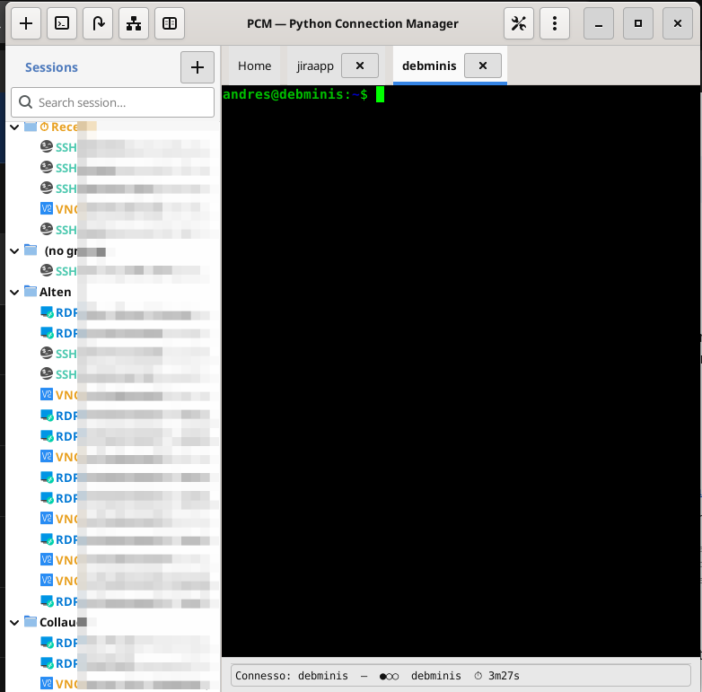<br><em>Finestra principale: sidebar con gruppi e sezione Recenti, terminale SSH integrato aperto, status bar connessione</em></td>
</tr>
</table>

### Dialogo nuova sessione — SSH

| | |
|---|---|
| 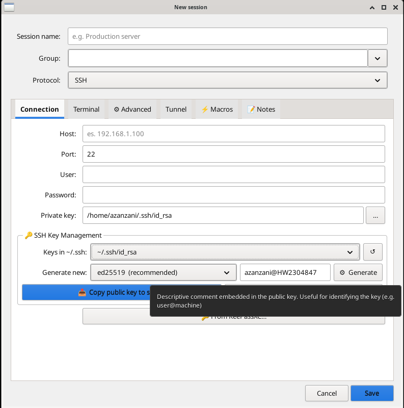 | 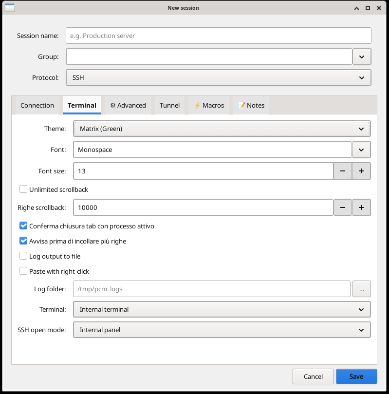 |
| *Tab Connessione — host, porta, utente, password, chiave privata, gestione chiavi SSH (genera ed25519/RSA, copia sul server), integrazione KeePassXC* | *Tab Terminale — tema, font, dimensione, scrollback, conferma chiusura, avviso incolla, log su file, modalità apertura SSH* |

| | |
|---|---|
| 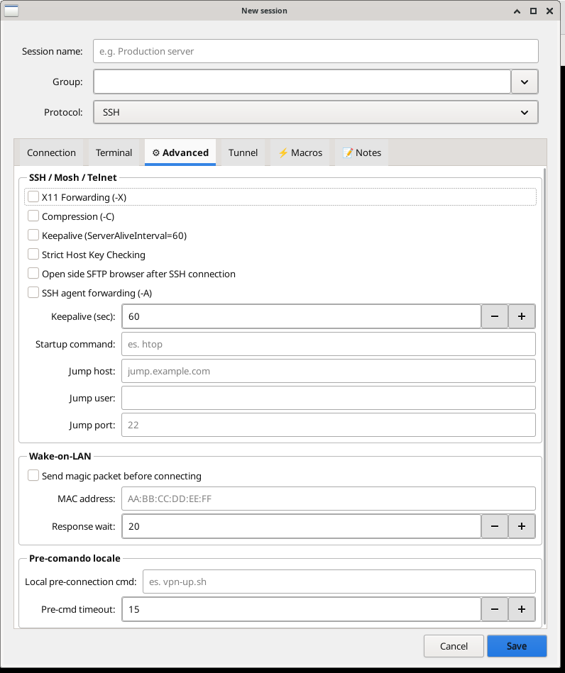 | 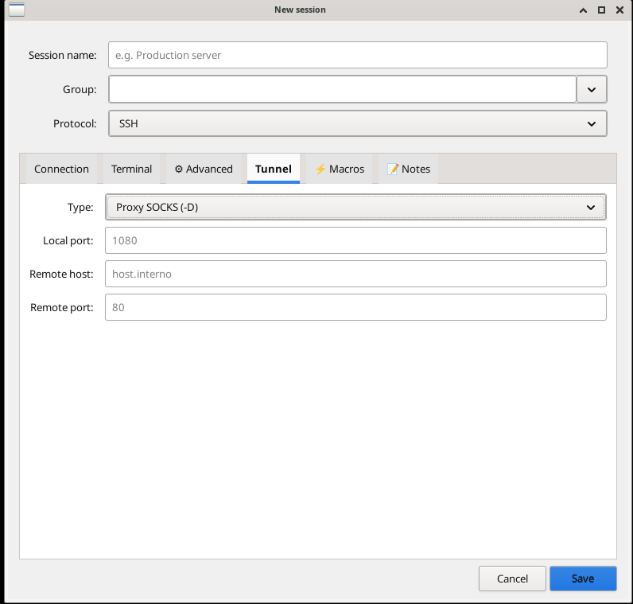 |
| *Tab Avanzate — X11 forwarding, compressione, keepalive, strict host, SFTP browser automatico, Agent Forwarding (-A), startup command, jump host, Wake-on-LAN, pre-comando locale* | *Tab Tunnel — tipo SOCKS proxy (-D) o port forwarding, porta locale, host e porta remoti* |

| | |
|---|---|
| 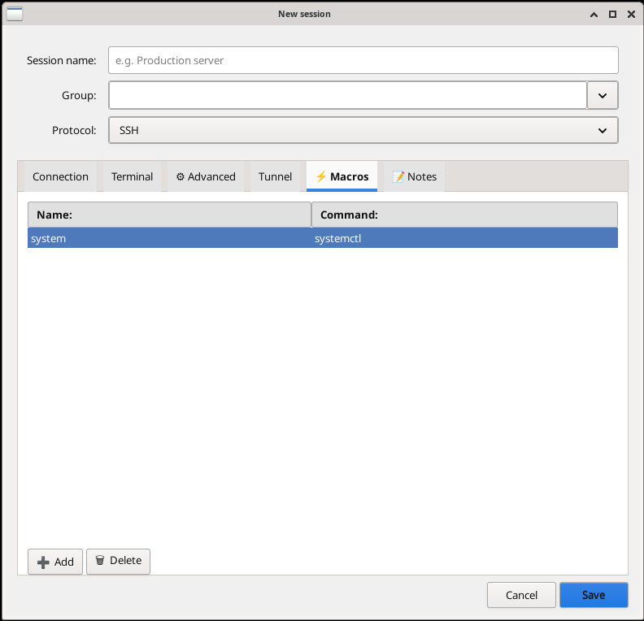 | 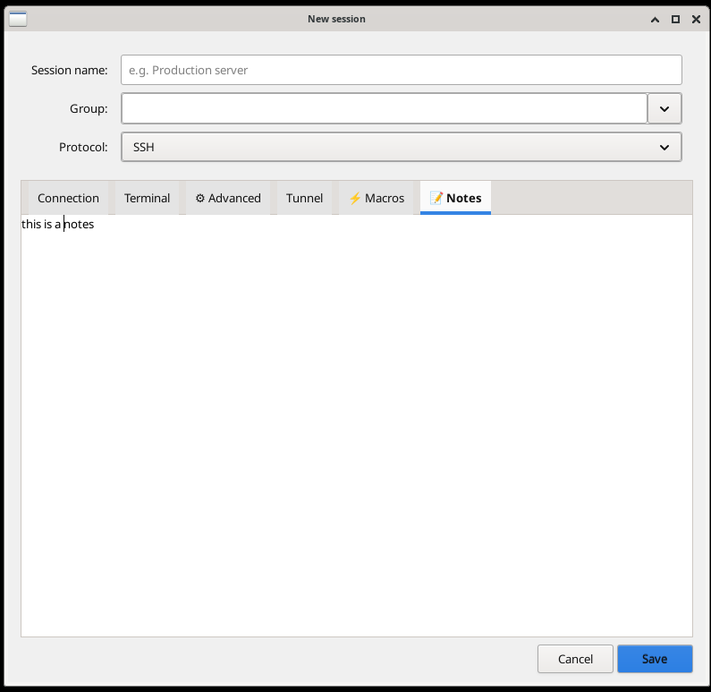 |
| *Tab Macro — comandi rapidi per sessione (nome → comando), inviati al terminale con un clic dalla sidebar* | *Tab Note — campo testo libero per annotazioni associate alla sessione* |

---

### Dialogo nuova sessione — RDP

| | |
|---|---|
| 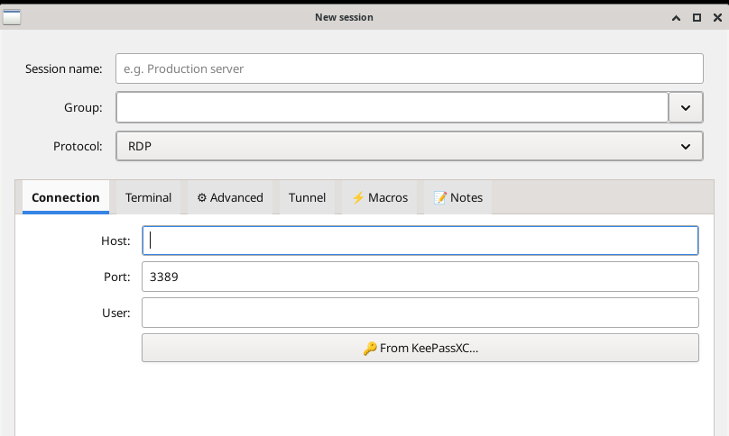 | 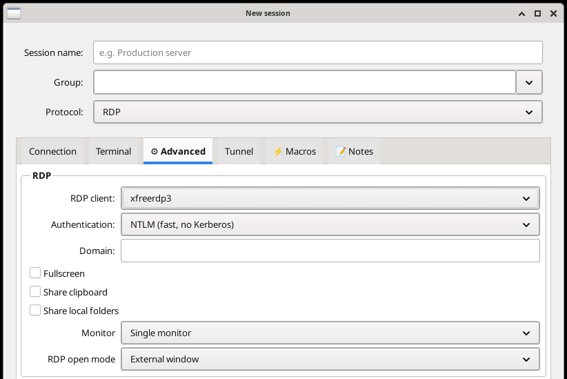 |
| *Tab Connessione RDP — host, porta 3389, utente, integrazione KeePassXC* | *Tab Avanzate RDP — client xfreerdp3, autenticazione NTLM/Kerberos, dominio, fullscreen, clipboard, cartelle locali, monitor, modalità apertura* |

---

### Dialogo nuova sessione — VNC e FTP/SFTP

| | |
|---|---|
| 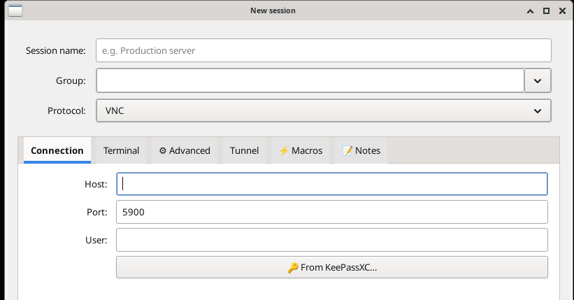 | 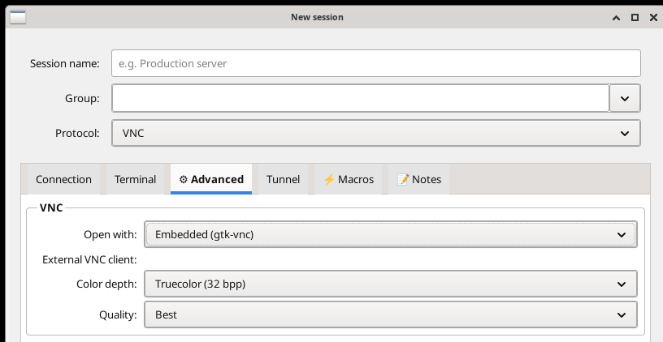 |
| *Tab Connessione VNC — host, porta 5900, utente, integrazione KeePassXC* | *Tab Avanzate VNC — apertura con gtk-vnc integrato o client esterno, profondità colore, qualità* |

| | |
|---|---|
| 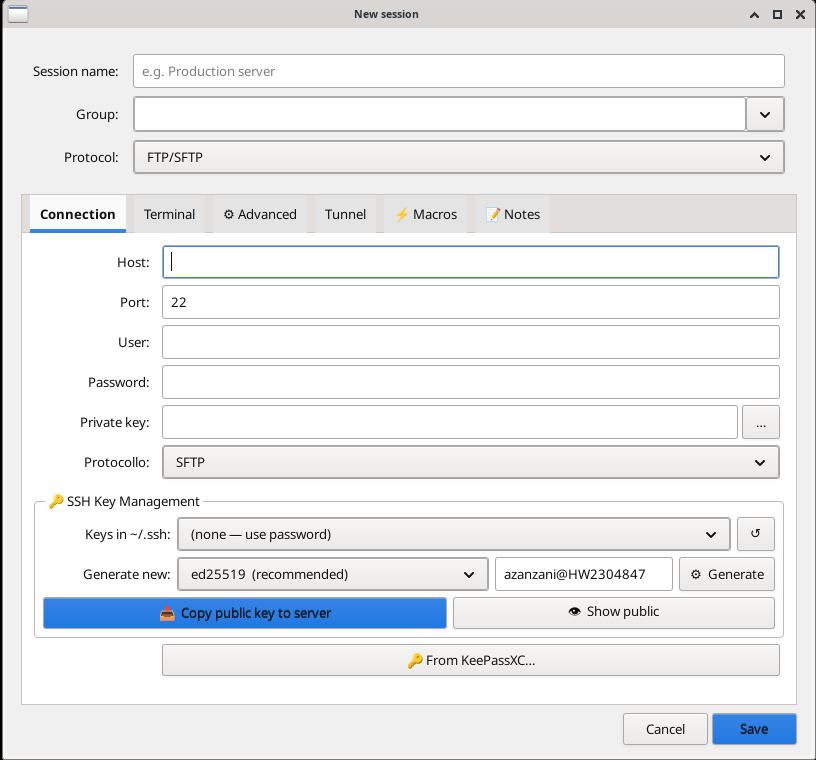 | 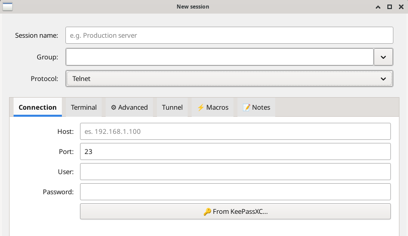 |
| *Tab Connessione FTP/SFTP — host, porta, utente, password, chiave privata, sottoprotocollo (SFTP/FTP/FTPS), gestione chiavi SSH, KeePassXC* | *Tab Connessione Telnet — host, porta 23, utente, password, integrazione KeePassXC* |

---

### Dialogo nuova sessione — Mosh, Seriale, Exec

| | |
|---|---|
| 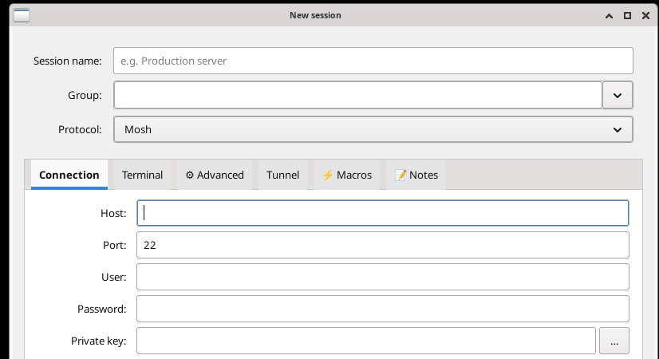 | 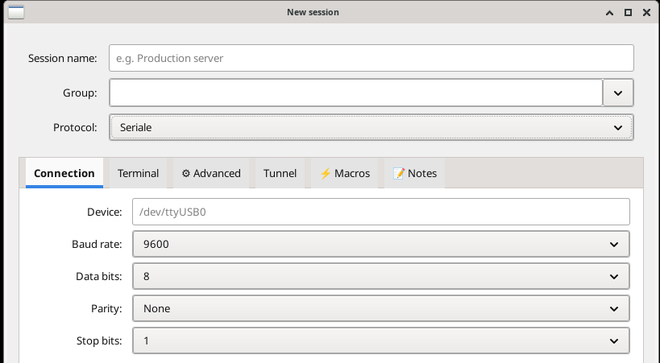 |
| *Connessione Mosh — host, porta SSH, utente, password, chiave privata* | *Connessione Seriale — device (/dev/ttyUSB0), baud rate, data bit, parity, stop bit* |

| | |
|---|---|
| 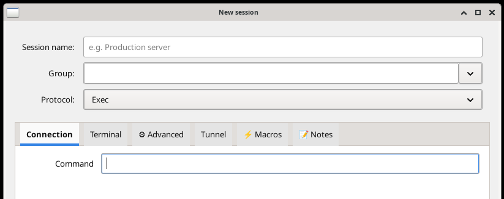 | |
| *Protocollo Exec — esegui qualsiasi comando shell in un tab VTE dedicato* | |

---

### Browser SFTP dual-pane

<table>
<tr>
<td colspan="2">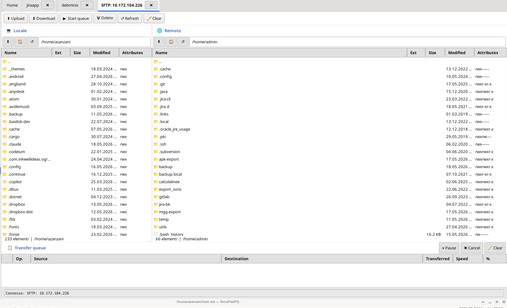<br><em>Browser SFTP integrato — pannello locale e remoto affiancati, upload/download, coda trasferimenti, drag &amp; drop</em></td>
</tr>
</table>

---

### Strumenti integrati

| | |
|---|---|
| 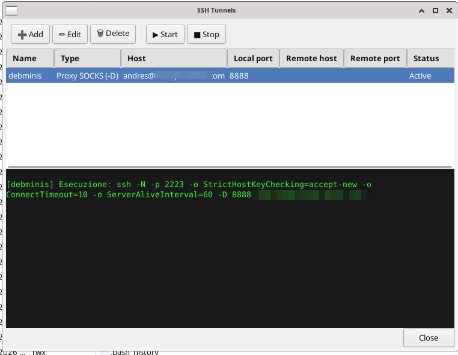 | 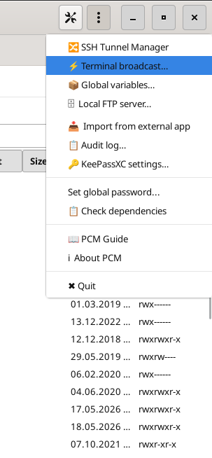 |
| *SSH Tunnel Manager — elenco tunnel con tipo, host, porte, stato; pulsanti Add/Edit/Delete/Start/Stop; log output integrato* | *Menu applicazione — Tunnel Manager, Broadcast, Variabili globali, Server FTP locale, Import, Audit log, KeePassXC, Dipendenze* |

| | |
|---|---|
| 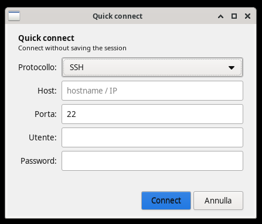 |  |
| *Quick Connect — connessione rapida senza salvare il profilo, scelta protocollo, host, porta, utente, password* | *Sblocco credenziali — master password per decifrare le credenziali salvate (AES-256)* |

| | |
|---|---|
| 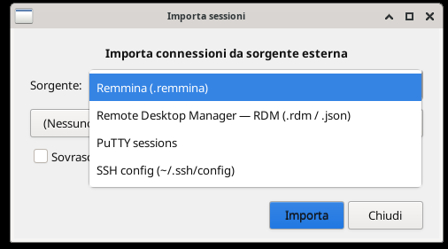 | |
| *Import sessioni — da Remmina (.remmina), Remote Desktop Manager (.rdm/.json), PuTTY, ~/.ssh/config* | |

---

## Avvio dalla riga di comando

PCM supporta l'apertura di connessioni direttamente dalla riga di comando tramite URI. Se PCM è già in esecuzione, la connessione viene aperta come nuova tab nella finestra esistente — senza chiedere di nuovo la password master se le credenziali sono già sbloccate.

### Formato URI

```
python3 PCM.py  proto://[utente@]host[:porta][?opzioni]
```

| Protocollo | Schema URI |
|---|---|
| SSH | `ssh://` |
| Telnet | `telnet://` |
| RDP | `rdp://` |
| VNC | `vnc://` |
| SFTP | `sftp://` |
| FTP | `ftp://` |
| FTPS | `ftps://` |
| Mosh | `mosh://` |

### Opzioni query string (solo connessioni ad-hoc)

| Parametro | Valori | Descrizione |
|---|---|---|
| `mode` | `internal` / `external` | Forza apertura embedded o in finestra esterna |
| `terminal` | `xterm`, `kitty`, … | Terminale esterno da usare (solo SSH/Telnet) |

### Esempi — Sessioni salvate

```bash
# Apre la sessione salvata di nome "jiraapp" (o con hostname "jiraapp")
python3 PCM.py ssh://jiraapp

# Apre la sessione RDP salvata "windowsserver"
python3 PCM.py rdp://windowsserver

# Apre la sessione SFTP salvata "nas"
python3 PCM.py sftp://nas

# Apre la sessione Telnet "router-core" e se PCM è già aperto la aggiunge come tab
python3 PCM.py telnet://router-core
```

### Esempi — Connessioni ad-hoc (non salvate)

```bash
# SSH ad-hoc: utente e host
python3 PCM.py ssh://admin@192.168.1.10

# SSH ad-hoc con porta non standard
python3 PCM.py ssh://deploy@prodserver.example.com:2222

# SSH in terminale esterno
python3 PCM.py 'ssh://user@host?mode=external'

# SSH in terminale esterno specifico
python3 PCM.py 'ssh://user@host?mode=external&terminal=kitty'

# RDP ad-hoc: si apre xfreerdp (default esterno)
python3 PCM.py rdp://192.168.1.50

# RDP embedded nel pannello PCM
python3 PCM.py 'rdp://user@192.168.1.50?mode=internal'

# VNC viewer esterno
python3 PCM.py vnc://raspberrypi

# VNC viewer embedded
python3 PCM.py 'vnc://192.168.1.60:5901?mode=internal'

# SFTP ad-hoc con utente
python3 PCM.py sftp://backup@nas.lan

# FTP ad-hoc
python3 PCM.py ftp://ftp.example.com

# FTPS ad-hoc
python3 PCM.py ftps://secure-ftp.example.com

# Telnet con porta personalizzata
python3 PCM.py telnet://cisco-switch:2323

# Mosh ad-hoc
python3 PCM.py mosh://user@remotehost
```

### Alias utili in ~/.bashrc

```bash
# Connessione rapida a host frequenti
alias jira='python3 ~/PCM/gtk3/PCM.py ssh://jiraapp'
alias nas='python3 ~/PCM/gtk3/PCM.py sftp://nas'
alias vpn-gw='python3 ~/PCM/gtk3/PCM.py ssh://vpn-gateway'

# RDP al PC Windows di lavoro
alias winpc='python3 ~/PCM/gtk3/PCM.py rdp://workpc'
```

### Comportamento con credenziali cifrate

Se `connections.json` è protetto con password master:
- Se PCM **non è aperto**: si apre, chiede la password master, poi apre la connessione
- Se PCM **è già aperto e sbloccato**: la connessione viene aperta direttamente, senza richiedere la password di nuovo

---

## Installazione

### GTK3 — versione raccomandata

#### Automatica

```bash
git clone https://github.com/buzzqw/Python_Connection_Manager.git
cd Python_Connection_Manager
bash setup.sh
```

Lo script rileva la distribuzione (Debian/Ubuntu, Arch, Fedora, openSUSE, FreeBSD) e installa tutte le dipendenze di sistema e Python. Crea anche un launcher `.desktop` nel menu applicazioni.

```bash
# Solo verifica dipendenze, senza installare:
bash setup.sh --check
```

#### Avvio

```bash
cd Python_Connection_Manager/gtk3
python3 PCM.py
```

Al primo avvio PCM crea `connections.json` con sessioni di esempio e propone di abilitare la cifratura AES-256 delle credenziali.

#### Manuale per distribuzione

<details>
<summary><b>Debian / Ubuntu / Linux Mint</b></summary>

```bash
sudo apt install \
    python3 python3-gi python3-gi-cairo \
    gir1.2-gtk-3.0 gir1.2-vte-2.91 gir1.2-gtkvnc-2.0 \
    openssh-client freerdp3-x11 tigervnc-viewer \
    xdotool xdg-utils wakeonlan

pip install --user cryptography paramiko pyftpdlib
```
</details>

<details>
<summary><b>Arch Linux</b></summary>

```bash
sudo pacman -Sy --needed \
    python python-gobject gtk3 vte3 gtk-vnc \
    openssh freerdp tigervnc xdotool xdg-utils wol \
    python-cryptography python-paramiko python-pyftpdlib
```
</details>

<details>
<summary><b>Fedora</b></summary>

```bash
sudo dnf install \
    python3-gobject gtk3 vte291 gtk-vnc2 \
    openssh-clients freerdp tigervnc xdotool xdg-utils

pip install --user cryptography paramiko pyftpdlib
```
</details>

<details>
<summary><b>openSUSE</b></summary>

```bash
sudo zypper install \
    python3-gobject typelib-1_0-Gtk-3_0 \
    typelib-1_0-Vte-2.91 typelib-1_0-GtkVnc-2_0 \
    openssh freerdp tigervnc xdotool xdg-utils

pip install --user cryptography paramiko pyftpdlib
```
</details>

<details>
<summary><b>FreeBSD</b></summary>

```bash
sudo pkg install \
    python3 py311-gobject gtk3 vte3 gtk-vnc \
    mosh freerdp3 tigervnc-viewer xdotool wakeonlan \
    py311-cryptography py311-paramiko py311-pyftpdlib
```
</details>

### PyQt6 — versione legacy

> Riceve solo bugfix critici. Istruzioni di installazione in [`pyqt6/README.md`](pyqt6/README.md).

---

## Dipendenze opzionali

| Pacchetto | Funzionalità abilitata |
|---|---|
| `gir1.2-gtkvnc-2.0` / `gtk-vnc` | VNC integrato nativo (raccomandato) |
| `tigervnc-viewer` / `xtightvncviewer` | VNC via client esterno (fallback) |
| `freerdp3-x11` / `xfreerdp` | RDP |
| `mosh` | Connessioni Mosh |
| `picocom` / `minicom` | Porte seriali |
| `xdotool` | RDP in pannello interno (richiede XWayland) |
| `wakeonlan` / `wol` | Wake-on-LAN |
| `keepassxc` | Integrazione KeePassXC |
| `pynacl` | Cifratura protocollo KeePassXC Browser v2 |

---

## Note Wayland

GTK3 + VTE funzionano **nativamente su Wayland** senza XWayland.

L'unica eccezione è la modalità **RDP pannello interno** (embedding xfreerdp tramite xdotool) che richiede XWayland. Per uso Wayland puro, impostare RDP su **"Finestra esterna"**.

Il viewer VNC `gtk-vnc` funziona nativamente su Wayland.

---

## File di configurazione

| File | Contenuto |
|---|---|
| `gtk3/connections.json` | Profili sessione — JSON leggibile, modificabile a mano |
| `gtk3/pcm_settings.json` | Impostazioni globali, scorciatoie, sessioni recenti |
| `gtk3/audit_log.json` | Log audit connessioni (solo metadata, nessuna credenziale) |
| `/tmp/pcm_logs/` | Log output terminali, percorso configurabile |

---

## Supporta il progetto

Se PCM ti è utile e vuoi ringraziare lo sviluppatore, puoi offrire un caffè tramite PayPal. Ogni contributo è molto apprezzato e aiuta a mantenere il progetto attivo!

[](https://www.paypal.com/cgi-bin/webscr?cmd=_donations&business=azanzani@gmail.com&item_name=Support+PCM+Project)

*Grazie mille!*

---

## Autore

**Andres Zanzani** — licenza [EUPL-1.2](EUPL-1.2%20EN.txt)

[](https://github.com/buzzqw/Python_Connection_Manager)

---
---

# PCM — Python Connection Manager 🇬🇧

> **The Linux alternative to MobaXterm** — everything in one window: SSH, RDP, VNC, SFTP, FTP, Telnet, Mosh, Serial.  
> Written in Python with GTK3 and native VTE terminal. Works on **X11 and Wayland** without XWayland.

---

## Available versions

| Version | Folder | Framework | Terminal | Wayland | Status |
|---|---|---|---|---|---|
| **GTK3** | [`gtk3/`](./gtk3/) | GTK3 (PyGObject) | Native VTE | ✅ Native | **Active development** |
| PyQt6 | [`pyqt6/`](./pyqt6/) | PyQt6 | xterm | XWayland required | Critical bugfixes only |

> The [`pyqt6/`](./pyqt6/) folder contains the legacy version (critical bugfixes only); new installations should prefer GTK3.

---

## Why PCM?

| | PCM | Remmina | Asbru | mRemoteNG |
|---|---|---|---|---|
| SSH with integrated terminal | ✅ Native VTE | ❌ RDP/VNC only | ✅ xterm | ✅ |
| RDP + VNC + SSH + FTP in one tool | ✅ | partial | ✅ | ✅ |
| Integrated SFTP/FTP browser | ✅ dual-pane | ❌ | partial | ❌ |
| Graphical SSH tunnels | ✅ | ❌ | ✅ | ❌ |
| Broadcast to multiple terminals | ✅ | ❌ | ✅ cluster | ❌ |
| KeePassXC integration | ✅ | ❌ | ❌ | ❌ |
| Native Wayland (no XWayland) | ✅ | partial | ❌ | ❌ Linux |
| Password NEVER on command line | ✅ feed_child | ❌ | ⚠️ expect | — |
| Human-readable config | ✅ JSON | complex XML | YAML | XML |
| License | EUPL-1.2 | GPL-2 | GPL-3 | GPL-2 |

---

## Supported protocols

**SSH · SFTP · FTP/FTPS · RDP · VNC · Telnet · Mosh · Serial · Exec · SSH Tunnel**

---

## Key features

### 🖥 Protocols — everything in one window

| Protocol | How it opens | Strengths |
|---|---|---|
| **SSH** | Internal VTE tab or external terminal | Jump Host, X11, Agent Forward, VPN pre-cmd, macros |
| **SFTP** | Integrated dual-pane browser | Drag & drop, transfer queue, rename |
| **FTP / FTPS** | Integrated browser or file manager | Explicit TLS, PASV mode |
| **RDP** | Internal panel or external window | xfreerdp3/xfreerdp/rdesktop, multi-monitor |
| **VNC** | Native gtk-vnc or external client | Scale, grab input, screenshot |
| **Telnet** | Internal VTE tab | — |
| **Mosh** | Internal VTE tab | Resilient to disconnections |
| **Serial** | Internal VTE tab | Baud, parity, stop bits configurable |
| **Exec** | Internal VTE tab | Any shell command in a tab |
| **SSH Tunnel** | Background, managed graphically | SOCKS -D, local -L, remote -R |

### 🔐 Security — above average

- **Password never on command line**: PCM types the password into the VTE terminal when the server asks for it (`feed_child`), just like a user would. No `sshpass`, nothing visible in `ps aux`.
- **SSH_ASKPASS fallback** for OpenSSH ≥ 8.4: if SSH handles auth before a prompt appears (keyboard-interactive), a temp helper script (mode `0700`) passes the password silently.
- **AES-256 encryption** (Fernet + PBKDF2-SHA256, 480k iterations): usernames and passwords in `connections.json` encrypted with a master password. The key never touches the disk.
- **KeePassXC integration** via Browser Protocol v2 (NaCl box): find and fill credentials directly from the open KeePassXC database — no browser needed.
- **SSH key management**: generate, copy to server, display public key.
- **Agent Forwarding** (`-A`): propagates ssh-agent keys for multiple hops without copying private keys.

### 💻 Advanced terminal

- **Native VTE** — zero X11 dependencies, works on pure Wayland
- **Vertical/horizontal split** — multiple sessions side by side in one window
- **Themes**: Dracula, Nord, Gruvbox, Solarized Dark/Light, One Dark, Monokai, Cobalt, Tomorrow Night and more
- **Per-session macros** — commands sent with one click from the sidebar
- **Terminal broadcast** — send the same text to all selected terminals simultaneously (ideal for clusters)
- **Multi-exec** — run a command across multiple sessions in sequence
- File output logging per session (via `script(1)`)
- Configurable or infinite scrollback per session
- Local pre-command: activate VPN or mount volume before opening the connection

### 📁 Session management

- Organized by **group** with live search bar
- **Recent sessions** section at the top of the sidebar: last 20 sessions with timestamps
- **Quick Connect**: `user@host:port` from the toolbar — connects without saving a profile
- Double-click to connect, right-click for rich context menu
- **TCP Ping** from the sidebar — checks reachability on the configured port (ms)
- Duplicate, edit, delete, export `.sh` script to reopen from terminal
- **Import** from: Remmina (`.remmina`), Remote Desktop Manager (`.rdm`/`.json`), PuTTY (`~/.putty/sessions/`), `~/.ssh/config`

### 🛠 Integrated tools

- **Graphical SSH tunnels** — start, stop, monitor background tunnels
- **Local FTP server** (pyftpdlib) — expose a local folder via FTP/FTPS in one click
- **Global variables** `{NAME}` — reusable in commands across all sessions
- **Wake-on-LAN** — sends magic packet before connecting
- **Audit log** — connection history with timestamp, duration, protocol, status; exportable to CSV
- **Dependency checker** — automatically checks which tools are installed

### 🌍 Internationalization

5 complete languages: 🇮🇹 Italiano · 🇬🇧 English · 🇩🇪 Deutsch · 🇫🇷 Français · 🇪🇸 Español  
Instant language change from settings without restart.

---

## Screenshots — GTK3 version (active development)

<table>
<tr>
<td colspan="2"><br><em>Main window: group sidebar with Recent section, embedded SSH terminal tab open, connection status bar</em></td>
</tr>
</table>

### New session dialog — SSH

| | |
|---|---|
|  |  |
| *Connection tab — host, port, user, password, private key, SSH key management (generate ed25519/RSA, copy to server), KeePassXC integration* | *Terminal tab — theme, font, size, scrollback, close confirmation, paste warning, file logging, SSH open mode* |

| | |
|---|---|
|  |  |
| *Advanced tab — X11 forwarding, compression, keepalive, strict host, auto-open SFTP browser, Agent Forwarding (-A), startup command, jump host, Wake-on-LAN, local pre-command* | *Tunnel tab — SOCKS proxy (-D) or port forwarding, local port, remote host and port* |

| | |
|---|---|
|  |  |
| *Macros tab — per-session quick commands (name → command), sent to the terminal with one click from the sidebar* | *Notes tab — free-text field for annotations attached to the session* |

---

### New session dialog — RDP

| | |
|---|---|
|  |  |
| *Connection tab — host, port 3389, user, KeePassXC integration* | *Advanced tab — xfreerdp3 client, NTLM/Kerberos auth, domain, fullscreen, clipboard, local folders, monitor, open mode* |

---

### New session dialog — VNC and FTP/SFTP

| | |
|---|---|
|  |  |
| *Connection tab — host, port 5900, user, KeePassXC integration* | *Advanced tab — open with embedded gtk-vnc or external client, color depth, quality* |

| | |
|---|---|
|  |  |
| *FTP/SFTP connection tab — host, port, user, password, private key, sub-protocol (SFTP/FTP/FTPS), SSH key management, KeePassXC* | *Telnet connection tab — host, port 23, user, password, KeePassXC integration* |

---

### New session dialog — Mosh, Serial, Exec

| | |
|---|---|
|  |  |
| *Mosh connection — host, SSH port, user, password, private key* | *Serial connection — device (/dev/ttyUSB0), baud rate, data bits, parity, stop bits* |

| | |
|---|---|
|  | |
| *Exec protocol — run any shell command in a dedicated VTE tab* | |

---

### Integrated SFTP dual-pane browser

<table>
<tr>
<td colspan="2"><br><em>Integrated SFTP browser — local and remote panels side by side, upload/download, transfer queue, drag &amp; drop</em></td>
</tr>
</table>

---

### Integrated tools

| | |
|---|---|
|  |  |
| *SSH Tunnel Manager — tunnel list with type, host, ports, status; Add/Edit/Delete/Start/Stop buttons; integrated output log* | *Application menu — Tunnel Manager, Broadcast, Global variables, Local FTP server, Import, Audit log, KeePassXC, Dependencies* |

| | |
|---|---|
|  |  |
| *Quick Connect — instant connection without saving a profile, choose protocol, host, port, user, password* | *Credential unlock — master password to decrypt saved credentials (AES-256)* |

| | |
|---|---|
|  | |
| *Import sessions — from Remmina (.remmina), Remote Desktop Manager (.rdm/.json), PuTTY, ~/.ssh/config* | |

---

## Command line launch

PCM supports opening connections directly from the command line via URI. If PCM is already running, the connection opens as a new tab in the existing window — without asking for the master password again if credentials are already unlocked.

### URI format

```
python3 PCM.py  proto://[user@]host[:port][?options]
```

| Protocol | URI scheme |
|---|---|
| SSH | `ssh://` |
| Telnet | `telnet://` |
| RDP | `rdp://` |
| VNC | `vnc://` |
| SFTP | `sftp://` |
| FTP | `ftp://` |
| FTPS | `ftps://` |
| Mosh | `mosh://` |

### Query string options (ad-hoc connections only)

| Parameter | Values | Description |
|---|---|---|
| `mode` | `internal` / `external` | Force embedded or external window |
| `terminal` | `xterm`, `kitty`, … | External terminal to use (SSH/Telnet only) |

### Examples — Saved sessions

```bash
# Open saved session named "jiraapp" (or with hostname "jiraapp")
python3 PCM.py ssh://jiraapp

# Open saved RDP session "windowsserver"
python3 PCM.py rdp://windowsserver

# Open saved SFTP session "nas"
python3 PCM.py sftp://nas

# Open Telnet session — if PCM is already open, adds it as a new tab
python3 PCM.py telnet://router-core
```

### Examples — Ad-hoc connections (not saved)

```bash
# SSH ad-hoc: user and host
python3 PCM.py ssh://admin@192.168.1.10

# SSH ad-hoc with non-standard port
python3 PCM.py ssh://deploy@prodserver.example.com:2222

# SSH in external terminal
python3 PCM.py 'ssh://user@host?mode=external'

# SSH in specific external terminal
python3 PCM.py 'ssh://user@host?mode=external&terminal=kitty'

# RDP ad-hoc: opens xfreerdp (external by default)
python3 PCM.py rdp://192.168.1.50

# RDP embedded inside PCM panel
python3 PCM.py 'rdp://user@192.168.1.50?mode=internal'

# VNC external viewer
python3 PCM.py vnc://raspberrypi

# VNC embedded viewer
python3 PCM.py 'vnc://192.168.1.60:5901?mode=internal'

# SFTP ad-hoc with user
python3 PCM.py sftp://backup@nas.lan

# FTP ad-hoc
python3 PCM.py ftp://ftp.example.com

# FTPS ad-hoc
python3 PCM.py ftps://secure-ftp.example.com

# Telnet with custom port
python3 PCM.py telnet://cisco-switch:2323

# Mosh ad-hoc
python3 PCM.py mosh://user@remotehost
```

### Useful aliases in ~/.bashrc

```bash
# Quick access to frequent hosts
alias jira='python3 ~/PCM/gtk3/PCM.py ssh://jiraapp'
alias nas='python3 ~/PCM/gtk3/PCM.py sftp://nas'
alias vpn-gw='python3 ~/PCM/gtk3/PCM.py ssh://vpn-gateway'

# RDP to Windows workstation
alias winpc='python3 ~/PCM/gtk3/PCM.py rdp://workpc'
```

### Behavior with encrypted credentials

If `connections.json` is protected with a master password:
- If PCM **is not open**: it starts, asks for the master password, then opens the connection
- If PCM **is already open and unlocked**: the connection opens immediately, no password prompt

---

## Quick install (GTK3 — recommended)

```bash
git clone https://github.com/buzzqw/Python_Connection_Manager.git
cd Python_Connection_Manager
bash setup.sh
cd gtk3
python3 PCM.py
```

> The `setup.sh` script detects the distribution and installs system dependencies (GTK3, VTE, gtk-vnc) and Python packages (paramiko, cryptography, pyftpdlib). It also creates a `.desktop` launcher in the application menu.

```bash
# Check dependencies only, without installing:
bash setup.sh --check
```

### Manual install by distribution

<details>
<summary><b>Debian / Ubuntu / Linux Mint</b></summary>

```bash
sudo apt install \
    python3 python3-gi python3-gi-cairo \
    gir1.2-gtk-3.0 gir1.2-vte-2.91 gir1.2-gtkvnc-2.0 \
    openssh-client freerdp3-x11 tigervnc-viewer \
    xdotool xdg-utils wakeonlan

pip install --user cryptography paramiko pyftpdlib
```
</details>

<details>
<summary><b>Arch Linux</b></summary>

```bash
sudo pacman -Sy --needed \
    python python-gobject gtk3 vte3 gtk-vnc \
    openssh freerdp tigervnc xdotool xdg-utils wol \
    python-cryptography python-paramiko python-pyftpdlib
```
</details>

<details>
<summary><b>Fedora</b></summary>

```bash
sudo dnf install \
    python3-gobject gtk3 vte291 gtk-vnc2 \
    openssh-clients freerdp tigervnc xdotool xdg-utils

pip install --user cryptography paramiko pyftpdlib
```
</details>

<details>
<summary><b>openSUSE</b></summary>

```bash
sudo zypper install \
    python3-gobject typelib-1_0-Gtk-3_0 \
    typelib-1_0-Vte-2.91 typelib-1_0-GtkVnc-2_0 \
    openssh freerdp tigervnc xdotool xdg-utils

pip install --user cryptography paramiko pyftpdlib
```
</details>

<details>
<summary><b>FreeBSD</b></summary>

```bash
sudo pkg install \
    python3 py311-gobject gtk3 vte3 gtk-vnc \
    mosh freerdp3 tigervnc-viewer xdotool wakeonlan \
    py311-cryptography py311-paramiko py311-pyftpdlib
```
</details>

### PyQt6 — legacy version

> Critical bugfixes only. See [`pyqt6/README.md`](pyqt6/README.md) for installation instructions.

---

## Optional dependencies

| Package | Feature enabled |
|---|---|
| `gir1.2-gtkvnc-2.0` / `gtk-vnc` | Native embedded VNC (recommended) |
| `tigervnc-viewer` / `xtightvncviewer` | VNC via external client (fallback) |
| `freerdp3-x11` / `xfreerdp` | RDP |
| `mosh` | Mosh connections |
| `picocom` / `minicom` | Serial ports |
| `xdotool` | RDP in internal panel (requires XWayland) |
| `wakeonlan` / `wol` | Wake-on-LAN |
| `keepassxc` | KeePassXC integration |
| `pynacl` | KeePassXC Browser Protocol v2 encryption |

---

## Wayland notes

GTK3 + VTE work **natively on Wayland** without XWayland.

The only exception is the **RDP internal panel** mode (embedding xfreerdp via xdotool), which requires XWayland. For pure Wayland use, set RDP to **"External window"**.

The `gtk-vnc` VNC viewer works natively on Wayland.

---

## Configuration files

| File | Contents |
|---|---|
| `gtk3/connections.json` | Session profiles — human-readable JSON, editable by hand |
| `gtk3/pcm_settings.json` | Global settings, shortcuts, recent sessions |
| `gtk3/audit_log.json` | Connection audit log (metadata only, no credentials) |
| `/tmp/pcm_logs/` | Terminal output logs, path configurable |

---

## Support the project

If you find PCM useful and want to thank the developer, you can buy him a coffee via PayPal. Any contribution is greatly appreciated and helps keep the project alive!

[](https://www.paypal.com/cgi-bin/webscr?cmd=_donations&business=azanzani@gmail.com&item_name=Support+PCM+Project)

*Thank you so much!*

---

## Author

**Andres Zanzani** — license [EUPL-1.2](EUPL-1.2%20EN.txt)

[](https://github.com/buzzqw/Python_Connection_Manager)
