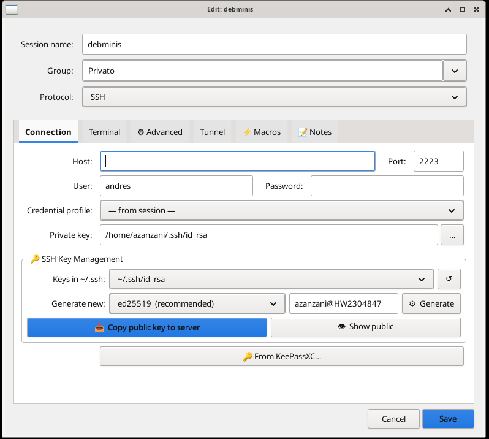
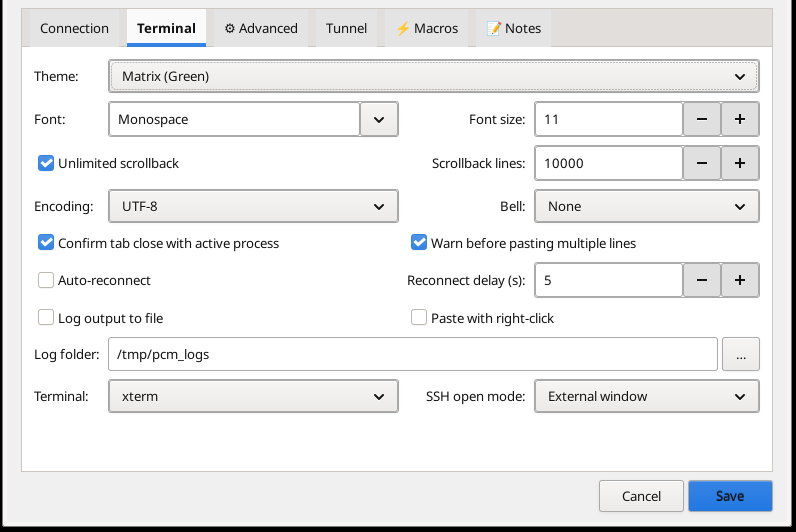
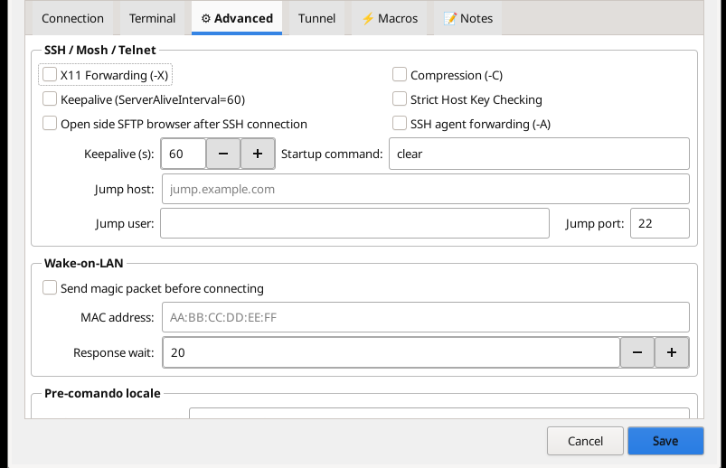
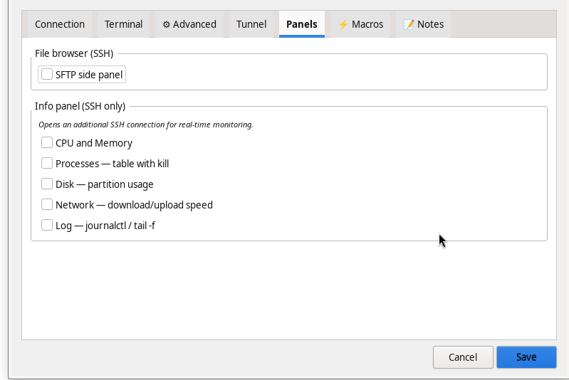
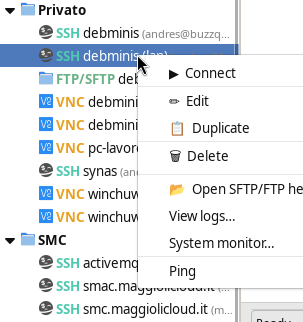
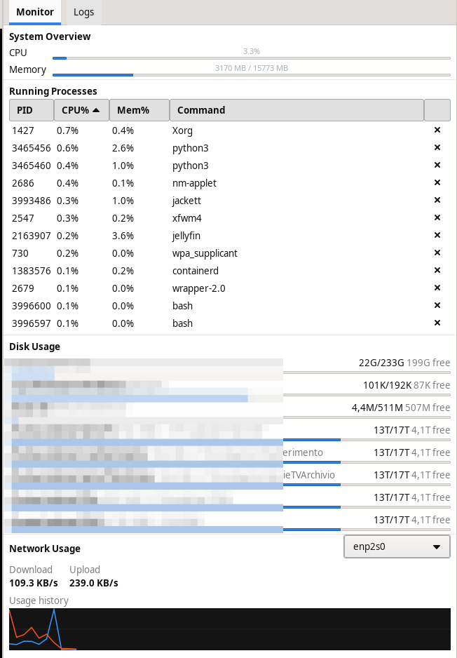

# PCM — Python Connection Manager

[](EUPL-1.2%20EN.txt)
[](https://www.python.org/)
[](https://docs.gtk.org/gtk3/)
[](#note-wayland)
[](#installazione)
[](https://github.com/buzzqw/Python_Connection_Manager/actions/workflows/build.yml)
[](https://www.paypal.com/cgi-bin/webscr?cmd=_donations&business=azanzani@gmail.com&item_name=Support+PCM+Project)

# PCM — Python Connection Manager 🇬🇧

> **The Linux alternative to MobaXterm** — everything in one window: SSH, RDP, VNC, SFTP, FTP, Telnet, Mosh, Serial.  
> Written in Python with GTK3 and native VTE terminal. Works on **X11 and Wayland** without XWayland.

---

## Available versions

| Version | Folder | Framework | Terminal | Wayland | Status |
|---|---|---|---|---|---|
| **GTK3** | [`gtk3/`](./gtk3/) | GTK3 (PyGObject) | Native VTE | ✅ Native | **Active development** |
| PyQt6 | [`pyqt6/`](./pyqt6/) | PyQt6 | xterm | XWayland required | Critical bugfixes only |

> The [`pyqt6/`](./pyqt6/) folder contains the legacy version (critical bugfixes only); new installations should prefer GTK3.

---

## Why PCM?

| | PCM | MobaXterm | Remmina | Asbru | mRemoteNG |
|---|---|---|---|---|---|
| SSH with integrated terminal | ✅ Native VTE | ✅ | ❌ RDP/VNC only | ✅ xterm | ✅ |
| RDP + VNC + SSH + FTP in one tool | ✅ | ✅ | partial | ✅ | ✅ |
| Integrated SFTP/FTP browser | ✅ dual-pane | ✅ dual-pane | ❌ | partial | ❌ |
| Directory sync local↔remote | ✅ | ✅ | ❌ | ❌ | ❌ |
| Graphical SSH tunnels | ✅ | ✅ | ❌ | ✅ | ❌ |
| Broadcast to multiple terminals | ✅ | ✅ MultiExec | ❌ | ✅ cluster | ❌ |
| Live system monitor panel | ✅ | ✅ | ❌ | ❌ | ❌ |
| KeePassXC integration | ✅ | ❌ | ❌ | ❌ | ❌ |
| Native Wayland (no XWayland) | ✅ | ❌ Windows only | partial | ❌ | ❌ Linux |
| Password NEVER on command line | ✅ autotyped into terminal | ✅ | ❌ | ⚠️ expect | — |
| Session restore on startup | ✅ | ✅ | ❌ | partial | ❌ |
| Command line launch (URI) | ✅ | ❌ | ❌ | ❌ | ❌ |
| Human-readable config | ✅ JSON | ❌ proprietary | complex XML | YAML | XML |
| Platform | Linux / FreeBSD | Windows only | Linux | Linux | Windows |
| License | EUPL-1.2 | Proprietary | GPL-2 | GPL-3 | GPL-2 |

---

## Supported protocols

**SSH · SFTP · FTP/FTPS · RDP · VNC · Telnet · Mosh · Serial · Exec · SSH Tunnel**

---

## Key features

### 🖥 Protocols — everything in one window

| Protocol | How it opens | Strengths |
|---|---|---|
| **SSH** | Internal VTE tab or external terminal | Jump Host, X11, Agent Forward, VPN pre-cmd, macros |
| **SFTP** | Integrated dual-pane browser | Drag & drop, transfer queue with progress/speed/ETA, rename, **directory sync local↔remote** |
| **FTP / FTPS** | Integrated browser or file manager | Explicit TLS, PASV mode |
| **RDP** | Internal panel or external window | xfreerdp3/xfreerdp/rdesktop, multi-monitor |
| **VNC** | Native gtk-vnc or external client | Scale, grab input, screenshot |
| **Telnet** | Internal VTE tab | — |
| **Mosh** | Internal VTE tab | Resilient to disconnections |
| **Serial** | Internal VTE tab | Baud, parity, stop bits configurable |
| **Exec** | Internal VTE tab | Any shell command in a tab |
| **SSH Tunnel** | Background, managed graphically | SOCKS -D, local -L, remote -R |

### 🔐 Security — above average

- **Password never on command line**: PCM types the password directly into the terminal when the server asks for it, just like a user would. No `sshpass`, nothing visible in `ps aux`.
- **SSH_ASKPASS fallback** for OpenSSH ≥ 8.4: the helper script is created in `~/.cache/pcm/` (permissions `0700`, not in `/tmp`) and deleted after 5 seconds. The password is passed via environment variable only, never written to the file.
- **Command injection protection**: all profile parameters (host, port, user, device, etc.) are sanitised with `shlex.quote()` before use in shell commands. Pre-commands run with `shell=False`.
- **Protected credential files** (`connections.json`, `pcm_settings.json`, `audit_log.json`): written with permissions `0600` — readable only by the owner.
- **SSH host key verification enabled**: `StrictHostKeyChecking=yes` on all connections. The SFTP browser uses paramiko `RejectPolicy` with automatic `known_hosts` loading.
- **AES-256 encryption** (Fernet + PBKDF2-SHA256, 480k iterations): usernames and passwords in `connections.json` encrypted with a master password. The key never touches the disk. The verification token uses a random canary to prevent offline dictionary attacks.
- **Audit log with hash chaining**: each entry includes the SHA-256 of the previous entry — tampering is detectable.
- **KeePassXC integration** via Browser Protocol v2 (NaCl box): find and fill credentials directly from the open KeePassXC database — no browser needed.
- **SSH key management**: generate, copy to server, display public key.
- **Agent Forwarding** (`-A`): propagates ssh-agent keys for multiple hops without copying private keys.

### 📊 SSH info panel (right sidebar)

Available for every SSH session, configurable per-session in the **Panels tab** of the session dialog. Opens alongside the terminal without a new window.

| Section | What it shows |
|---|---|
| **System Overview** | CPU % (progress bar) and RAM usage (used / total), updated every 2 seconds |
| **Running Processes** | Sortable table (click any column header) with PID, CPU%, Mem%, Command — kill button per process |
| **Disk Usage** | One card per partition: mount point, device, used/total, free space, progress bar |
| **Network Usage** | Download/Upload speed per second with dual-line sparkline (60-sample history), interface selector |
| **Logs** | Streaming `journalctl` or `tail -f` viewer with regex filter, level colouring and auto-scroll |

The panel reuses the monitor's existing SSH connection — zero extra TCP connections.  
Each section can be individually enabled or disabled per session.

### 💻 Advanced terminal

- **Native VTE** — zero X11 dependencies, works on pure Wayland
- **Vertical/horizontal split** — multiple sessions side by side in one window
- **Themes**: Dracula, Nord, Gruvbox, Solarized Dark/Light, One Dark, Monokai, Cobalt, Tomorrow Night and more
- **Per-session macros** — commands sent with one click from the sidebar
- **Terminal broadcast** — send the same text to all selected terminals simultaneously (ideal for clusters)
- **Multi-exec** — run a command across multiple sessions in sequence
- File output logging per session (via `script(1)`)
- Configurable or infinite scrollback per session
- Local pre-command: activate VPN or mount volume before opening the connection

### 📁 Session management

- Organized by **group** with live search bar
- **Active session indicator** — green dot ● next to session names with an open connection
- **Recent sessions** section at the top of the sidebar: last 20 sessions with timestamps
- **Quick Connect**: `user@host:port` from the toolbar — connects without saving a profile
- Double-click to connect, right-click for rich context menu on both the **session list** and the **open tab** — including "View logs…" and "System monitor…" for SSH sessions
- **TCP Ping** from the sidebar — checks reachability on the configured port (ms)
- **Session restore** — optionally save open sessions on close and reopen them automatically at the next startup (Settings → General)
- Duplicate, edit, delete, export `.sh` script to reopen from terminal
- **Import** from: Remmina (`.remmina`), Remote Desktop Manager (`.rdm`/`.json`), PuTTY (`~/.putty/sessions/`), `~/.ssh/config`

### 🛠 Integrated tools

- **Graphical SSH tunnels** — start, stop, monitor background tunnels; **toolbar indicator** with quick popup to stop tunnels without opening the full manager
- **SFTP directory sync** — compare a local folder with a remote one (by size + modification time), review the diff table with per-file direction control, execute using the existing transfer queue with progress/speed/ETA
- **SFTP progress bar** — the lateral SFTP panel shows a real-time progress bar during upload and download (via paramiko callback)
- **Local FTP server** (pyftpdlib) — expose a local folder via FTP/FTPS in one click
- **Global variables** `{NAME}` — reusable in commands across all sessions
- **Wake-on-LAN** — sends magic packet before connecting
- **Audit log** — connection history with timestamp, duration, protocol, status; exportable to CSV
- **Dependency checker** — automatically checks which tools are installed

### 🌍 Internationalization

5 complete languages: 🇮🇹 Italiano · 🇬🇧 English · 🇩🇪 Deutsch · 🇫🇷 Français · 🇪🇸 Español  
Instant language change from settings without restart.

---

## Screenshots — GTK3 version (active development)

<table>
<tr>
<td colspan="2"><br><em>Main window: group sidebar with Recent section, embedded SSH terminal tab open, connection status bar</em></td>
</tr>
</table>

### New session dialog — SSH

| | |
|---|---|
|  |  |
| *Connection tab — host, port, user, password, private key, SSH key management (generate ed25519/RSA, copy to server), KeePassXC integration* | *Terminal tab — theme, font, size, scrollback, close confirmation, paste warning, file logging, SSH open mode* |

| | |
|---|---|
|  |  |
| *Advanced tab — X11 forwarding, compression, keepalive, strict host, auto-open SFTP browser, Agent Forwarding (-A), startup command, jump host, Wake-on-LAN, local pre-command* | *Tunnel tab — SOCKS proxy (-D) or port forwarding, local port, remote host and port* |

| | |
|---|---|
|  |  |
| *Panels tab — enable/disable per-session: SFTP side panel, Info panel sections (CPU/Memory, Processes with kill, Disk, Network sparkline, Log streaming)* | *Macros tab — per-session quick commands (name → command), sent to the terminal with one click from the sidebar* |

| | |
|---|---|
|  | |
| *Notes tab — free-text field for annotations attached to the session* | |

---

### New session dialog — RDP

| | |
|---|---|
|  |  |
| *Connection tab — host, port 3389, user, KeePassXC integration* | *Advanced tab — xfreerdp3 client, NTLM/Kerberos auth, domain, fullscreen, clipboard, local folders, monitor, open mode* |

---

### New session dialog — VNC and FTP/SFTP

| | |
|---|---|
|  |  |
| *Connection tab — host, port 5900, user, KeePassXC integration* | *Advanced tab — open with embedded gtk-vnc or external client, color depth, quality* |

| | |
|---|---|
|  |  |
| *FTP/SFTP connection tab — host, port, user, password, private key, sub-protocol (SFTP/FTP/FTPS), SSH key management, KeePassXC* | *Telnet connection tab — host, port 23, user, password, KeePassXC integration* |

---

### New session dialog — Mosh, Serial, Exec

| | |
|---|---|
|  |  |
| *Mosh connection — host, SSH port, user, password, private key* | *Serial connection — device (/dev/ttyUSB0), baud rate, data bits, parity, stop bits* |

| | |
|---|---|
|  | |
| *Exec protocol — run any shell command in a dedicated VTE tab* | |

---

### Integrated SFTP dual-pane browser

<table>
<tr>
<td colspan="2"><br><em>Integrated SFTP browser — local and remote panels side by side, upload/download, transfer queue, drag &amp; drop</em></td>
</tr>
</table>

---

### Integrated tools

| | |
|---|---|
|  |  |
| *Session context menu — Connect, Edit, Duplicate, Delete, Open SFTP/FTP browser, View logs, System monitor, Ping* | *SSH Info panel — System Overview (CPU/RAM), Running Processes (sortable, kill button), Disk Usage, Network sparkline, Logs tab* |

| | |
|---|---|
|  |  |
| *SSH Tunnel Manager — tunnel list with type, host, ports, status; Add/Edit/Delete/Start/Stop buttons; integrated output log* | *Application menu — Tunnel Manager, Broadcast, Global variables, Local FTP server, Import, Audit log, KeePassXC, Dependencies* |

| | |
|---|---|
|  |  |
| *Quick Connect — instant connection without saving a profile, choose protocol, host, port, user, password* | *Credential unlock — master password to decrypt saved credentials (AES-256)* |

| | |
|---|---|
|  | |
| *Import sessions — from Remmina (.remmina), Remote Desktop Manager (.rdm/.json), PuTTY, ~/.ssh/config* | |

---

## Command line launch

PCM accepts a URI on startup or while already running — in the latter case the connection opens as a new tab in the existing window, without prompting for the master password again.

```bash
# Open saved session "jiraapp" (looks up by name, then by hostname)
python3 PCM.py ssh://jiraapp

# Ad-hoc connection (no saved session needed)
python3 PCM.py ssh://admin@192.168.1.10:2222
```

Supported schemes: `ssh://` `rdp://` `vnc://` `sftp://` `ftp://` `ftps://` `telnet://` `mosh://`  
For the full reference with all examples, see the built-in manual (**Help** menu).

---

## Download

The latest release is available on [**GitHub Releases**](https://github.com/buzzqw/Python_Connection_Manager/releases/latest) with:

| Format | Notes |
|---|---|
| **AppImage** (`PCM-N-x86_64.AppImage`) | Self-contained, no installation needed. Requires `libgtk-3-0` + `libvte-2.91-0` on the system. |
| `.deb` | Debian / Ubuntu / Linux Mint |
| `.tar.gz` / `.zip` | Any distribution |

---

## Quick install (GTK3 — recommended)

### AppImage (easiest)

```bash
chmod +x PCM-*-x86_64.AppImage
./PCM-*-x86_64.AppImage
```

Configuration and sessions are stored in `~/.config/pcm/` (persistent across updates).

### From source

```bash
git clone https://github.com/buzzqw/Python_Connection_Manager.git
cd Python_Connection_Manager
bash setup.sh
cd gtk3
python3 PCM.py
```

> The `setup.sh` script detects the distribution and installs system dependencies (GTK3, VTE, gtk-vnc) and Python packages (paramiko, cryptography, pyftpdlib). It also creates a `.desktop` launcher in the application menu.

```bash
# Check dependencies only, without installing:
bash setup.sh --check
```

### Manual install by distribution

<details>
<summary><b>Debian / Ubuntu / Linux Mint</b></summary>

```bash
sudo apt install \
    python3 python3-gi python3-gi-cairo \
    gir1.2-gtk-3.0 gir1.2-vte-2.91 gir1.2-gtk-vnc-2.0 \
    openssh-client mosh freerdp3-x11 tigervnc-viewer \
    xdotool xdg-utils wakeonlan

pip install --user cryptography paramiko pyftpdlib
```
</details>

<details>
<summary><b>Arch Linux</b></summary>

```bash
sudo pacman -Sy --needed \
    python python-gobject gtk3 vte3 gtk-vnc \
    openssh mosh freerdp tigervnc xdotool xdg-utils wol \
    python-cryptography python-paramiko python-pyftpdlib
```
</details>

<details>
<summary><b>Fedora</b></summary>

```bash
sudo dnf install \
    python3-gobject gtk3 vte291 gtk-vnc2 \
    openssh-clients mosh freerdp tigervnc xdotool xdg-utils

pip install --user cryptography paramiko pyftpdlib
```
</details>

<details>
<summary><b>openSUSE</b></summary>

```bash
sudo zypper install \
    python3-gobject typelib-1_0-Gtk-3_0 \
    typelib-1_0-Vte-2.91 typelib-1_0-GtkVnc-2_0 \
    openssh mosh freerdp tigervnc xdotool xdg-utils

pip install --user cryptography paramiko pyftpdlib
```
</details>

<details>
<summary><b>FreeBSD</b></summary>

```bash
sudo pkg install \
    python3 py311-gobject gtk3 vte3 gtk-vnc \
    mosh freerdp3 tigervnc-viewer xdotool wakeonlan \
    py311-cryptography py311-paramiko py311-pyftpdlib
```
</details>

### PyQt6 — legacy version

> Critical bugfixes only. See [`pyqt6/README.md`](pyqt6/README.md) for installation instructions.

---

## Optional dependencies

| Package | Feature enabled |
|---|---|
| `gir1.2-gtk-vnc-2.0` / `gtk-vnc` | Native embedded VNC (recommended) |
| `tigervnc-viewer` / `xtightvncviewer` | VNC via external client (fallback) |
| `freerdp3-x11` / `xfreerdp` | RDP |
| `mosh` | Mosh connections |
| `picocom` / `minicom` | Serial ports |
| `xdotool` | RDP in internal panel (requires XWayland) |
| `wakeonlan` / `wol` | Wake-on-LAN |
| `keepassxc` | KeePassXC integration |
| `pynacl` | KeePassXC Browser Protocol v2 encryption |

---

## Wayland notes

GTK3 + VTE work **natively on Wayland** without XWayland.

The only exception is the **RDP internal panel** mode (embedding xfreerdp via xdotool), which requires XWayland. For pure Wayland use, set RDP to **"External window"**.

The `gtk-vnc` VNC viewer works natively on Wayland.

---

## Configuration files

| File | Contents |
|---|---|
| `gtk3/connections.json` | Session profiles — human-readable JSON, editable by hand. Permissions `0600`. |
| `gtk3/pcm_settings.json` | Global settings, shortcuts, recent sessions. Permissions `0600`. |
| `gtk3/audit_log.json` | Connection audit log with SHA-256 hash chaining. Permissions `0600`. |
| `~/.local/share/pcm/logs/` | Terminal output logs (default), path configurable |
| `~/.cache/pcm/` | SSH_ASKPASS temp files (dir `0700`, deleted after 5s) |

> **AppImage**: when running as AppImage, the three JSON files above are stored in `~/.config/pcm/` (the AppImage filesystem is read-only). Configuration persists across AppImage updates.

---

## Support the project

If you find PCM useful and want to thank the developer, you can buy him a coffee via PayPal. Any contribution is greatly appreciated and helps keep the project alive!

[](https://www.paypal.com/cgi-bin/webscr?cmd=_donations&business=azanzani@gmail.com&item_name=Support+PCM+Project)

*Thank you so much!*

---

## Author

**Andres Zanzani** — license [EUPL-1.2](EUPL-1.2%20EN.txt)

[](https://github.com/buzzqw/Python_Connection_Manager)

---
---

# PCM — Python Connection Manager 🇮🇹

> **L'alternativa Linux a MobaXterm** — tutto in una finestra: SSH, RDP, VNC, SFTP, FTP, Telnet, Mosh, Seriale.  
> Scritto in Python con GTK3 e terminale VTE nativo. Funziona su **X11 e Wayland** senza XWayland.

> 📦 **Download ultima versione** — disponibile su [**GitHub Releases**](https://github.com/buzzqw/Python_Connection_Manager/releases/latest): AppImage (pronto all'uso), pacchetto `.deb` per Debian/Ubuntu, archivio `.tar.gz` e `.zip`.
---

## Versioni disponibili

| Versione | Cartella | Framework | Terminale | Wayland | Stato |
|---|---|---|---|---|---|
| **GTK3** | [`gtk3/`](./gtk3/) | GTK3 (PyGObject) | VTE nativo | ✅ Nativo | **Sviluppo attivo** |
| PyQt6 | [`pyqt6/`](./pyqt6/) | PyQt6 | xterm | XWayland richiesto | Solo bugfix critici |

> La cartella [`pyqt6/`](./pyqt6/) contiene la versione legacy (solo bugfix critici); le nuove installazioni devono preferire GTK3.

---

## Perché PCM?

| | PCM | MobaXterm | Remmina | Asbru | mRemoteNG |
|---|---|---|---|---|---|
| SSH con terminale integrato | ✅ VTE nativo | ✅ | ❌ solo RDP/VNC | ✅ xterm | ✅ |
| RDP + VNC + SSH + FTP in un tool | ✅ | ✅ | parziale | ✅ | ✅ |
| Browser SFTP/FTP integrato | ✅ dual-pane | ✅ dual-pane | ❌ | parziale | ❌ |
| Sincronizzazione directory locale↔remota | ✅ | ✅ | ❌ | ❌ | ❌ |
| Tunnel SSH grafici | ✅ | ✅ | ❌ | ✅ | ❌ |
| Broadcast a più terminali | ✅ | ✅ MultiExec | ❌ | ✅ cluster | ❌ |
| Pannello monitor sistema live | ✅ | ✅ | ❌ | ❌ | ❌ |
| KeePassXC integrato | ✅ | ❌ | ❌ | ❌ | ❌ |
| Wayland nativo (no XWayland) | ✅ | ❌ solo Windows | parziale | ❌ | ❌ Linux |
| Password MAI sulla command line | ✅ automaticamente digitata nel terminale | ✅ | ❌ | ⚠️ expect | — |
| Ripristino sessioni all'avvio | ✅ | ✅ | ❌ | parziale | ❌ |
| Avvio da riga di comando (URI) | ✅ | ❌ | ❌ | ❌ | ❌ |
| Configurazione leggibile | ✅ JSON | ❌ proprietario | XML complesso | YAML | XML |
| Piattaforma | Linux / FreeBSD | solo Windows | Linux | Linux | Windows |
| Licenza | EUPL-1.2 | Proprietario | GPL-2 | GPL-3 | GPL-2 |

---

## Protocolli supportati

**SSH · SFTP · FTP/FTPS · RDP · VNC · Telnet · Mosh · Seriale · Exec · SSH Tunnel**

---

## Funzionalità principali

### 🖥 Protocolli — tutto in una finestra

| Protocollo | Come si apre | Punti di forza |
|---|---|---|
| **SSH** | Tab VTE interno o terminale esterno | Jump Host, X11, Agent Forward, pre-cmd VPN, macro |
| **SFTP** | Browser dual-pane integrato | Drag & drop, coda trasferimenti con progresso/velocità/ETA, rinomina, **sincronizzazione directory locale↔remota** |
| **FTP / FTPS** | Browser integrato o file manager | TLS esplicito, modalità PASV |
| **RDP** | Pannello interno o finestra esterna | xfreerdp3/xfreerdp/rdesktop, multi-monitor |
| **VNC** | gtk-vnc nativo o client esterno | Scala, grab input, screenshot |
| **Telnet** | Tab VTE interno | — |
| **Mosh** | Tab VTE interno | Resistente a disconnessioni |
| **Seriale** | Tab VTE interno | Baud, parità, stop bit configurabili |
| **Exec** | Tab VTE interno | Qualsiasi comando shell in una scheda |
| **SSH Tunnel** | Background gestito graficamente | SOCKS -D, locale -L, remoto -R |

### 🔐 Sicurezza — sopra la media

- **Password mai sulla command line**: PCM digita la password direttamente nel terminale quando il server la richiede, esattamente come farebbe un utente. Nessun `sshpass`, nessun argomento visibile in `ps aux`.
- **Fallback SSH_ASKPASS** per OpenSSH ≥ 8.4: lo script helper è creato in `~/.cache/pcm/` (permessi `0700`, non in `/tmp`) ed eliminato dopo 5 secondi. La password è passata solo via variabile d'ambiente, mai scritta nel file.
- **Protezione command injection**: tutti i parametri dei profili (host, porta, utente, device, ecc.) sono sanificati con `shlex.quote()` prima di essere usati nei comandi shell. Il pre-comando è eseguito con `shell=False`.
- **File credenziali protetti** (`connections.json`, `pcm_settings.json`, `audit_log.json`): scritti con permessi `0600` — leggibili solo dal proprietario.
- **Verifica host key SSH attiva**: `StrictHostKeyChecking=yes` su tutte le connessioni. Il browser SFTP usa `RejectPolicy` di paramiko con caricamento automatico di `known_hosts`.
- **Cifratura AES-256** (Fernet + PBKDF2-SHA256, 480k iterazioni): utenti e password in `connections.json` cifrati con password master. La chiave non tocca mai il disco. Il token di verifica usa un canary casuale per prevenire attacchi a dizionario offline.
- **Audit log con hash chaining**: ogni voce include l'SHA-256 della voce precedente — le manomissioni sono rilevabili.
- **KeePassXC integrato** via Browser Protocol v2 (NaCl box): cerca e compila credenziali direttamente dal database KeePassXC aperto — nessun browser necessario.
- **Gestione chiavi SSH**: genera, copia sul server, visualizza la chiave pubblica.
- **Agent Forwarding** (`-A`): propaga le chiavi ssh-agent per hop multipli senza copiare le chiavi private.

### 📊 Pannello informazioni sessione SSH (sidebar destra)

Disponibile per ogni sessione SSH, configurabile per-sessione nel **tab Pannelli** del dialogo sessione. Si apre a fianco del terminale senza aprire nuove finestre.

| Sezione | Cosa mostra |
|---|---|
| **System Overview** | CPU % (barra) e utilizzo RAM (usato / totale), aggiornati ogni 2 secondi |
| **Running Processes** | Tabella ordinabile per colonna (PID, CPU%, Mem%, Command) — pulsante kill per processo |
| **Disk Usage** | Una card per partizione: mount point, device, usato/totale, spazio libero, barra progresso |
| **Network Usage** | Velocità download/upload in byte/s con sparkline doppia (60 campioni), selettore interfaccia |
| **Logs** | Streaming `journalctl` o `tail -f` con filtro regex, colorazione per livello, auto-scroll |

Il pannello riusa la connessione SSH del monitor — nessuna connessione TCP aggiuntiva.  
Ogni sezione è abilitabile o disabilitabile individualmente per sessione.

### 💻 Terminale avanzato

- **VTE nativo** — zero dipendenze X11, funziona su Wayland puro
- **Split verticale/orizzontale** — più sessioni affiancate nella stessa finestra
- **Temi**: Dracula, Nord, Gruvbox, Solarized Dark/Light, One Dark, Monokai, Cobalt, Tomorrow Night e altri
- **Macro per sessione** — comandi inviati con un clic dalla sidebar
- **Broadcast terminali** — invia lo stesso testo a tutti i terminali selezionati contemporaneamente (ideale per cluster)
- **Multi-exec** — esegui un comando su più sessioni in sequenza
- Log output su file per ogni sessione (con `script(1)`)
- Scrollback configurabile o infinito per sessione
- Pre-comando locale: attiva VPN o monta volume prima di aprire la connessione

### 📁 Gestione sessioni

- Organizzate per **gruppo** con barra di ricerca live
- **Indicatore sessioni attive** — pallino verde ● accanto al nome delle sessioni con connessione aperta
- **Sezione Recenti** in cima alla sidebar: ultime 20 sessioni con timestamp
- **Quick Connect**: `utente@host:porta` dalla toolbar — si connette senza salvare un profilo
- Doppio clic per connettere, tasto destro per menu contestuale ricco sia **sull'elenco sessioni** che sui **tab aperti** — include "Visualizza log…" e "Monitor sistema…" per sessioni SSH
- **Ping TCP** dalla sidebar — verifica raggiungibilità sulla porta configurata (ms)
- **Ripristino sessioni** — salva opzionalmente le sessioni aperte alla chiusura e le riapre automaticamente al prossimo avvio (Impostazioni → Generale)
- Duplica, modifica, elimina, esporta script `.sh` per riaprire da terminale
- **Import** da: Remmina (`.remmina`), Remote Desktop Manager (`.rdm`/`.json`), PuTTY (`~/.putty/sessions/`), `~/.ssh/config`

### 🛠 Strumenti integrati

- **Tunnel SSH** grafici — avvia, ferma, monitora tunnel in background; **indicatore nella toolbar** con popup rapido per fermare i tunnel senza aprire il gestore
- **Sincronizzazione directory SFTP** — confronta cartella locale con cartella remota (per dimensione + data modifica), rivedi la tabella diff con controllo della direzione per file, esegui usando la coda trasferimenti esistente con progresso/velocità/ETA
- **Barra progresso SFTP** — il pannello SFTP laterale mostra una barra di progresso in tempo reale durante upload e download (tramite callback paramiko)
- **Server FTP locale** (pyftpdlib) — espone una cartella locale via FTP/FTPS in un clic
- **Variabili globali** `{NOME}` — riutilizzabili nei comandi di tutte le sessioni
- **Wake-on-LAN** — invia magic packet prima di connettersi
- **Audit log** — storico connessioni con timestamp, durata, protocollo, stato; esportabile CSV
- **Verifica dipendenze** — controlla automaticamente quali tool sono installati

### 🌍 Internazionalizzazione

5 lingue complete: 🇮🇹 Italiano · 🇬🇧 English · 🇩🇪 Deutsch · 🇫🇷 Français · 🇪🇸 Español  
Cambio lingua immediato dalle impostazioni senza riavvio.

---

## Screenshot — Versione GTK3 (sviluppo attivo)

<table>
<tr>
<td colspan="2"><br><em>Finestra principale: sidebar con gruppi e sezione Recenti, terminale SSH integrato aperto, status bar connessione</em></td>
</tr>
</table>

### Dialogo nuova sessione — SSH

| | |
|---|---|
|  |  |
| *Tab Connessione — host, porta, utente, password, chiave privata, gestione chiavi SSH (genera ed25519/RSA, copia sul server), integrazione KeePassXC* | *Tab Terminale — tema, font, dimensione, scrollback, conferma chiusura, avviso incolla, log su file, modalità apertura SSH* |

| | |
|---|---|
|  |  |
| *Tab Avanzate — X11 forwarding, compressione, keepalive, strict host, SFTP browser automatico, Agent Forwarding (-A), startup command, jump host, Wake-on-LAN, pre-comando locale* | *Tab Tunnel — tipo SOCKS proxy (-D) o port forwarding, porta locale, host e porta remoti* |

| | |
|---|---|
|  |  |
| *Tab Pannelli — abilita/disabilita per sessione: pannello SFTP laterale, sezioni Info panel (CPU/Memoria, Processi con kill, Disco, Sparkline rete, Log streaming)* | *Tab Macro — comandi rapidi per sessione (nome → comando), inviati al terminale con un clic dalla sidebar* |

| | |
|---|---|
|  | |
| *Tab Note — campo testo libero per annotazioni associate alla sessione* | |

---

### Dialogo nuova sessione — RDP

| | |
|---|---|
|  |  |
| *Tab Connessione RDP — host, porta 3389, utente, integrazione KeePassXC* | *Tab Avanzate RDP — client xfreerdp3, autenticazione NTLM/Kerberos, dominio, fullscreen, clipboard, cartelle locali, monitor, modalità apertura* |

---

### Dialogo nuova sessione — VNC e FTP/SFTP

| | |
|---|---|
|  |  |
| *Tab Connessione VNC — host, porta 5900, utente, integrazione KeePassXC* | *Tab Avanzate VNC — apertura con gtk-vnc integrato o client esterno, profondità colore, qualità* |

| | |
|---|---|
|  |  |
| *Tab Connessione FTP/SFTP — host, porta, utente, password, chiave privata, sottoprotocollo (SFTP/FTP/FTPS), gestione chiavi SSH, KeePassXC* | *Tab Connessione Telnet — host, porta 23, utente, password, integrazione KeePassXC* |

---

### Dialogo nuova sessione — Mosh, Seriale, Exec

| | |
|---|---|
|  |  |
| *Connessione Mosh — host, porta SSH, utente, password, chiave privata* | *Connessione Seriale — device (/dev/ttyUSB0), baud rate, data bit, parity, stop bit* |

| | |
|---|---|
|  | |
| *Protocollo Exec — esegui qualsiasi comando shell in un tab VTE dedicato* | |

---

### Browser SFTP dual-pane

<table>
<tr>
<td colspan="2"><br><em>Browser SFTP integrato — pannello locale e remoto affiancati, upload/download, coda trasferimenti, drag &amp; drop</em></td>
</tr>
</table>

---

### Strumenti integrati

| | |
|---|---|
|  |  |
| *Menu contestuale sessione — Connetti, Modifica, Duplica, Elimina, Apri browser SFTP/FTP, Visualizza log, Monitor sistema, Ping* | *Pannello Info SSH — System Overview (CPU/RAM), Processi in esecuzione (ordinabile, kill), Utilizzo disco, Sparkline rete, tab Log* |

| | |
|---|---|
|  |  |
| *SSH Tunnel Manager — elenco tunnel con tipo, host, porte, stato; pulsanti Add/Edit/Delete/Start/Stop; log output integrato* | *Menu applicazione — Tunnel Manager, Broadcast, Variabili globali, Server FTP locale, Import, Audit log, KeePassXC, Dipendenze* |

| | |
|---|---|
|  |  |
| *Quick Connect — connessione rapida senza salvare il profilo, scelta protocollo, host, porta, utente, password* | *Sblocco credenziali — master password per decifrare le credenziali salvate (AES-256)* |

| | |
|---|---|
|  | |
| *Import sessioni — da Remmina (.remmina), Remote Desktop Manager (.rdm/.json), PuTTY, ~/.ssh/config* | |

---

## Avvio dalla riga di comando

PCM accetta un URI alla prima apertura o con PCM già in esecuzione: in quel caso la connessione viene aggiunta come nuova tab nella finestra esistente, senza richiedere di nuovo la password master.

```bash
# Apre la sessione salvata "jiraapp" (cerca per nome, poi per hostname)
python3 PCM.py ssh://jiraapp

# Connessione ad-hoc (non deve essere salvata in PCM)
python3 PCM.py ssh://admin@192.168.1.10:2222
```

Protocolli supportati: `ssh://` `rdp://` `vnc://` `sftp://` `ftp://` `ftps://` `telnet://` `mosh://`  
Per la documentazione completa con tutti gli esempi consulta il manuale integrato (menu **Aiuto**).

---

## Installazione

### GTK3 — versione raccomandata

#### AppImage (il modo più semplice)

```bash
chmod +x PCM-*-x86_64.AppImage
./PCM-*-x86_64.AppImage
```

Nessuna installazione richiesta. Sessioni e impostazioni vengono salvate in `~/.config/pcm/` (persistono tra un aggiornamento e l'altro).  
Richiede sul sistema: `libgtk-3-0` e `libvte-2.91-0` (presenti di default su qualsiasi desktop GTK3).

#### Da sorgente (automatica)

```bash
git clone https://github.com/buzzqw/Python_Connection_Manager.git
cd Python_Connection_Manager
bash setup.sh
```

Lo script rileva la distribuzione (Debian/Ubuntu, Arch, Fedora, openSUSE, FreeBSD) e installa tutte le dipendenze di sistema e Python. Crea anche un launcher `.desktop` nel menu applicazioni.

```bash
# Solo verifica dipendenze, senza installare:
bash setup.sh --check
```

#### Avvio (da sorgente)

```bash
cd Python_Connection_Manager/gtk3
python3 PCM.py
```

Al primo avvio PCM crea `connections.json` con sessioni di esempio e propone di abilitare la cifratura AES-256 delle credenziali.

#### Manuale per distribuzione

<details>
<summary><b>Debian / Ubuntu / Linux Mint</b></summary>

```bash
sudo apt install \
    python3 python3-gi python3-gi-cairo \
    gir1.2-gtk-3.0 gir1.2-vte-2.91 gir1.2-gtk-vnc-2.0 \
    openssh-client mosh freerdp3-x11 tigervnc-viewer \
    xdotool xdg-utils wakeonlan

pip install --user cryptography paramiko pyftpdlib
```
</details>

<details>
<summary><b>Arch Linux</b></summary>

```bash
sudo pacman -Sy --needed \
    python python-gobject gtk3 vte3 gtk-vnc \
    openssh mosh freerdp tigervnc xdotool xdg-utils wol \
    python-cryptography python-paramiko python-pyftpdlib
```
</details>

<details>
<summary><b>Fedora</b></summary>

```bash
sudo dnf install \
    python3-gobject gtk3 vte291 gtk-vnc2 \
    openssh-clients mosh freerdp tigervnc xdotool xdg-utils

pip install --user cryptography paramiko pyftpdlib
```
</details>

<details>
<summary><b>openSUSE</b></summary>

```bash
sudo zypper install \
    python3-gobject typelib-1_0-Gtk-3_0 \
    typelib-1_0-Vte-2.91 typelib-1_0-GtkVnc-2_0 \
    openssh mosh freerdp tigervnc xdotool xdg-utils

pip install --user cryptography paramiko pyftpdlib
```
</details>

<details>
<summary><b>FreeBSD</b></summary>

```bash
sudo pkg install \
    python3 py311-gobject gtk3 vte3 gtk-vnc \
    mosh freerdp3 tigervnc-viewer xdotool wakeonlan \
    py311-cryptography py311-paramiko py311-pyftpdlib
```
</details>

### PyQt6 — versione legacy

> Riceve solo bugfix critici. Istruzioni di installazione in [`pyqt6/README.md`](pyqt6/README.md).

---

## Dipendenze opzionali

| Pacchetto | Funzionalità abilitata |
|---|---|
| `gir1.2-gtk-vnc-2.0` / `gtk-vnc` | VNC integrato nativo (raccomandato) |
| `tigervnc-viewer` / `xtightvncviewer` | VNC via client esterno (fallback) |
| `freerdp3-x11` / `xfreerdp` | RDP |
| `mosh` | Connessioni Mosh |
| `picocom` / `minicom` | Porte seriali |
| `xdotool` | RDP in pannello interno (richiede XWayland) |
| `wakeonlan` / `wol` | Wake-on-LAN |
| `keepassxc` | Integrazione KeePassXC |
| `pynacl` | Cifratura protocollo KeePassXC Browser v2 |

---

## Note Wayland

GTK3 + VTE funzionano **nativamente su Wayland** senza XWayland.

L'unica eccezione è la modalità **RDP pannello interno** (embedding xfreerdp tramite xdotool) che richiede XWayland. Per uso Wayland puro, impostare RDP su **"Finestra esterna"**.

Il viewer VNC `gtk-vnc` funziona nativamente su Wayland.

---

## File di configurazione

| File | Contenuto |
|---|---|
| `gtk3/connections.json` | Profili sessione — JSON leggibile, modificabile a mano. Permessi `0600`. |
| `gtk3/pcm_settings.json` | Impostazioni globali, scorciatoie, sessioni recenti. Permessi `0600`. |
| `gtk3/audit_log.json` | Log audit connessioni con hash chaining SHA-256. Permessi `0600`. |
| `~/.local/share/pcm/logs/` | Log output terminali (default), percorso configurabile |
| `~/.cache/pcm/` | File temporanei SSH_ASKPASS (dir `0700`, file eliminati dopo 5s) |

> **AppImage**: quando si usa l'AppImage i tre file JSON sopra vengono scritti in `~/.config/pcm/` (il filesystem dell'AppImage è in sola lettura). La configurazione persiste tra un aggiornamento e l'altro.

---

## Supporta il progetto

Se PCM ti è utile e vuoi ringraziare lo sviluppatore, puoi offrire un caffè tramite PayPal. Ogni contributo è molto apprezzato e aiuta a mantenere il progetto attivo!

[](https://www.paypal.com/cgi-bin/webscr?cmd=_donations&business=azanzani@gmail.com&item_name=Support+PCM+Project)

*Grazie mille!*

---

## Autore

**Andres Zanzani** — licenza [EUPL-1.2](EUPL-1.2%20EN.txt)

[](https://github.com/buzzqw/Python_Connection_Manager)
