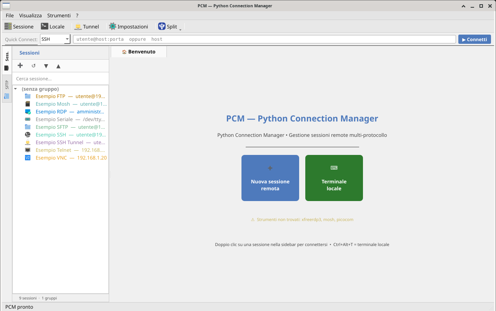
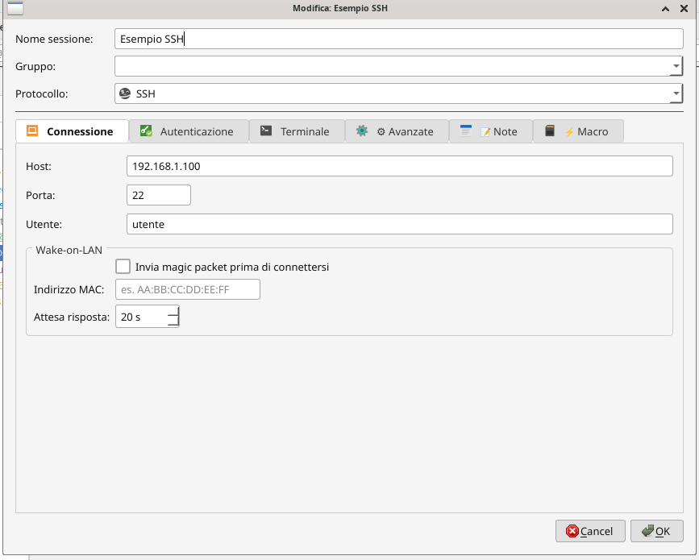
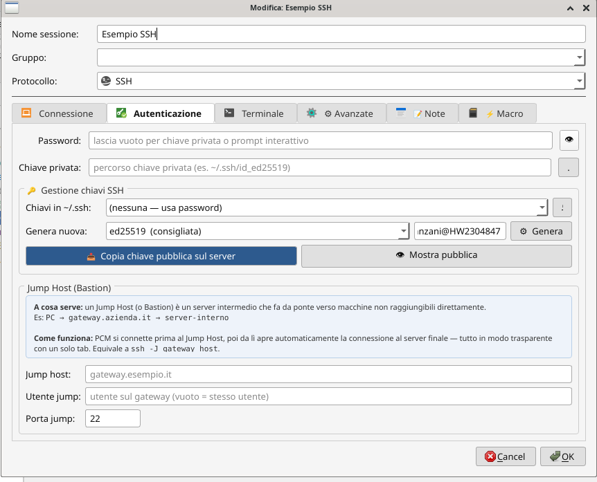
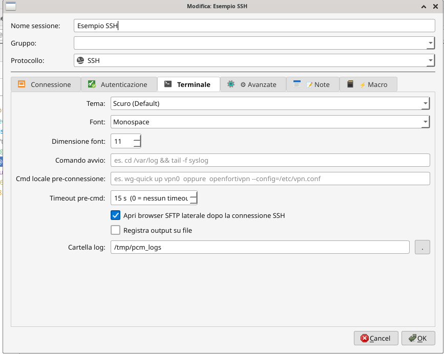
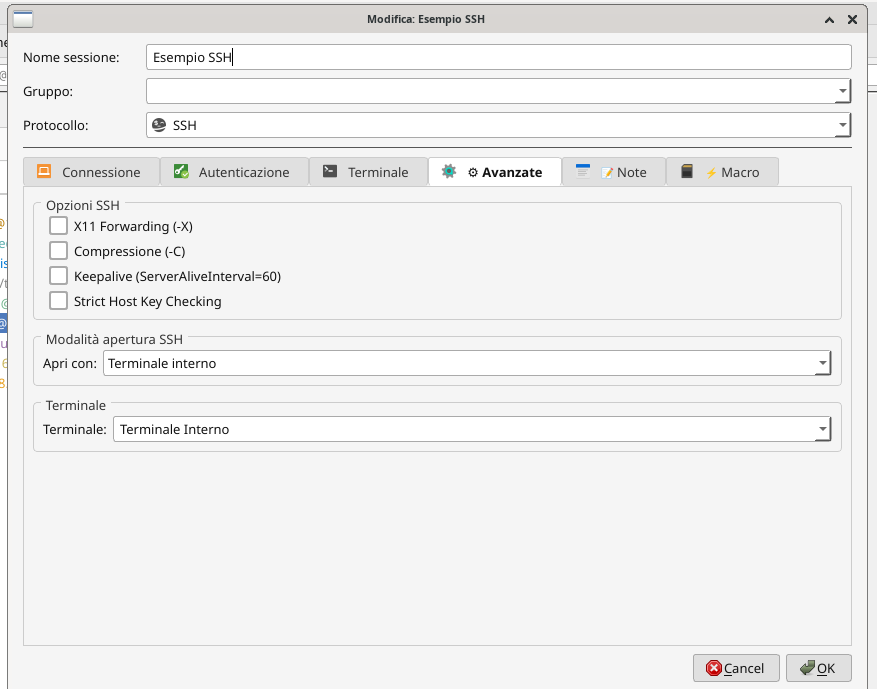
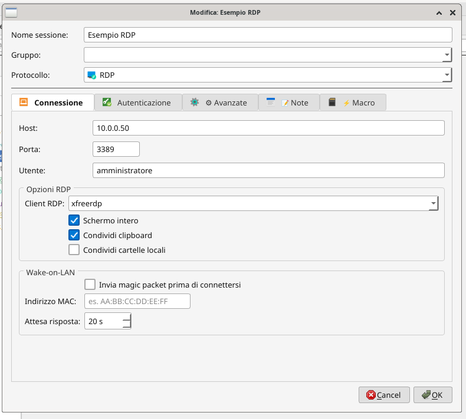
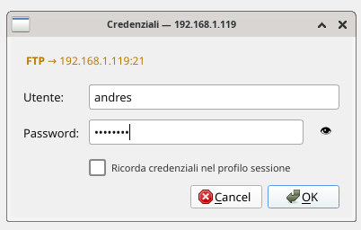

# PCM — Python Connection Manager

> Gestore grafico di connessioni remote per Linux, ispirato a MobaXterm.
> Scritto in Python, disponibile in due versioni: **PyQt6** e **GTK3**.

---


*Schermata principale — sidebar sessioni, quick connect, terminale VTE integrato*

---

## Versioni disponibili

| Versione | Cartella | Framework | Terminale | Wayland |
|---|---|---|---|---|
| Originale | [`pyqt6/`](./pyqt6/) | PyQt6 | xterm | XWayland richiesto |
| GTK3 | [`gtk3/`](./gtk3/) | GTK3 (PyGObject) | VTE nativo | ✅ Nativo |

La versione **GTK3** è quella attivamente sviluppata e raccomandata per nuove installazioni.

---

## Protocolli supportati

**SSH · SFTP · FTP/FTPS · RDP · VNC · Telnet · Mosh · Seriale · SSH Tunnel**

---

## Funzionalità principali

- 🖥 **Sessioni organizzate per gruppo** con ricerca istantanea
- ⚡ **Quick Connect** dalla toolbar — `utente@host:porta`
- 🔐 **Cifratura credenziali** AES-256 (PBKDF2-SHA256, 480k iterazioni)
- 📂 **Browser FTP/SFTP** dual-pane stile WinSCP con coda trasferimenti
- 🔀 **Tunnel SSH** gestiti graficamente (SOCKS, locale, remoto)
- 💻 **Split terminale** verticale/orizzontale — più sessioni in parallelo
- ⚡ **Macro per sessione** e **Multi-exec** su più server contemporaneamente
- 🌐 **Wake-on-LAN** integrato prima della connessione
- 📥 **Import** da Remmina e Remote Desktop Manager
- 🔑 **Gestione chiavi SSH**: genera, copia, mostra pubblica
- 🖧 **Server FTP locale** integrato (pyftpdlib)
- 🌍 **5 lingue**: Italiano · English · Deutsch · Français · Español

---

## Screenshot

| | |
|---|---|
|  |  |
| *Configurazione sessione SSH con Wake-on-LAN* | *Autenticazione SSH e gestione chiavi* |
|  |  |
| *Opzioni terminale, pre-cmd VPN, log* | *Opzioni avanzate SSH, modalità apertura* |
|  |  |
| *Configurazione RDP* | *Browser FTP dual-pane integrato* |

---

## Installazione rapida (GTK3)

```bash
git clone https://github.com/buzzqw/Python_Connection_Manager.git
cd Python_Connection_Manager/gtk3
bash setup.sh          # installa automaticamente per Debian/Ubuntu/Arch/Fedora/openSUSE
python3 PCM.py
```

Per la versione PyQt6 e le istruzioni complete vedi [`pyqt6/README.md`](./pyqt6/README.md).

---

## Autore

**Andres Zanzani** — licenza [EUPL-1.2](EUPL-1.2%20EN.txt)

[](https://github.com/buzzqw/Python_Connection_Manager)
