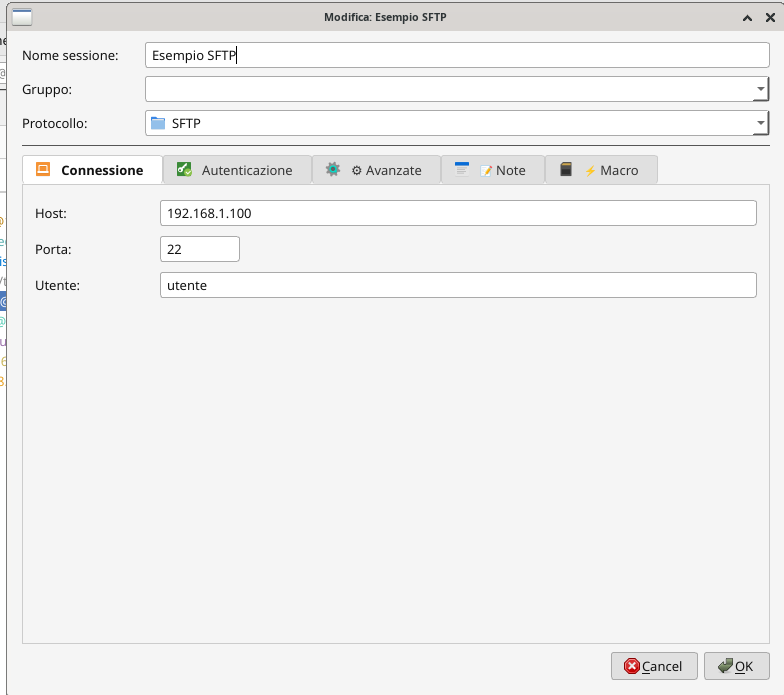
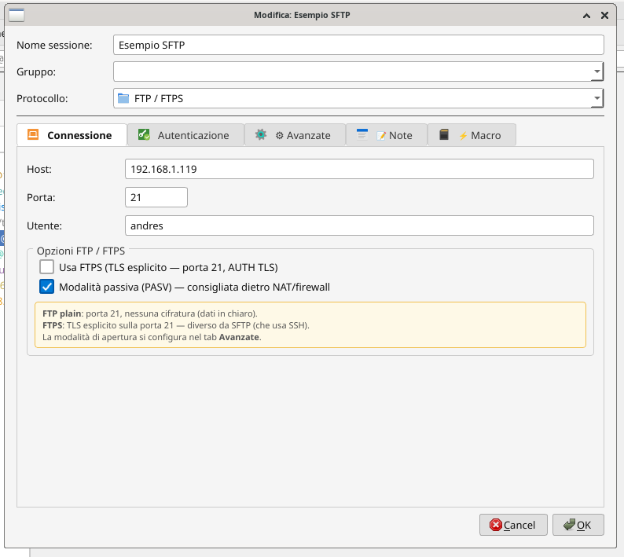

# PCM — Python Connection Manager (GTK3)

> Gestore grafico di connessioni remote per Linux, ispirato a MobaXterm.
> Scritto in Python con GTK3 e terminale VTE nativo — funziona su **X11 e Wayland**.

---

## Screenshot

### Schermata principale

*Sidebar con sessioni organizzate per gruppo, quick connect, terminale locale integrato*

### Gestione sessioni — Connessione SSH

*Configurazione completa: host, porta, Wake-on-LAN integrato*

### Autenticazione SSH avanzata

*Gestione chiavi SSH, generazione chiave, copia sul server, Jump Host (Bastion)*

### Configurazione terminale

*Tema, font, pre-comando locale (VPN), browser SFTP automatico, log output*

### Opzioni avanzate SSH

*X11 forwarding, compressione, keepalive, strict host key, modalità apertura*

### Sessione RDP

*Configurazione RDP con client selezionabile (xfreerdp3/xfreerdp/rdesktop), schermo intero, clipboard*

### Sessione SFTP


### Sessione FTP/FTPS

*FTP plain e FTPS (TLS esplicito), modalità passiva PASV*

### Browser FTP integrato (WinSCP-style)

*Dual-pane locale/remoto, upload/download con coda, nuova cartella, elimina, aggiorna*

### Nuova sessione in inglese

*Interfaccia completamente internazionalizzata (IT/EN/DE/FR/ES)*

---

## Caratteristiche

### Protocolli supportati

| Protocollo | Modalità | Note |
|---|---|---|
| **SSH** | Terminale integrato (VTE) o esterno | Jump Host, X11 forward, pre-cmd VPN |
| **SFTP** | Browser dual-pane integrato | Drag&drop, coda trasferimenti |
| **FTP / FTPS** | Browser integrato o client esterno | TLS esplicito, modalità passiva |
| **RDP** | Finestra esterna o pannello interno | xfreerdp3, xfreerdp, rdesktop |
| **VNC** | gtk-vnc nativo o client esterno | Toolbar runtime: scala, grab, screenshot |
| **Telnet** | Terminale integrato | — |
| **Mosh** | Terminale integrato | Richiede mosh installato |
| **Seriale** | Terminale integrato | Baud rate, parità, stop bit configurabili |
| **SSH Tunnel** | Background gestito graficamente | SOCKS -D, locale -L, remoto -R |

### Gestione sessioni

- Sessioni organizzate per **gruppo** con barra di ricerca
- **Quick Connect** dalla toolbar: `utente@host:porta`
- Doppio clic per connettere, tasto destro per menu contestuale
- Duplica, modifica, elimina, esporta script `.sh`
- **Verifica raggiungibilità** (ping/tcp) prima di connettere

### Sicurezza

- **Cifratura credenziali** AES-256 (Fernet + PBKDF2-SHA256, 480k iterazioni)
- Password master richiesta all'avvio se cifratura attiva
- Gestione chiavi SSH: genera, copia sul server, mostra pubblica
- Modalità **protetta**: nasconde tutte le password nell'interfaccia

### Terminale

- Terminale **VTE** nativo — zero dipendenze X11 su Wayland
- Temi: Dracula, Nord, Gruvbox, Solarized, One Dark, Monokai, Cobalt, Zenburn e altri
- Split verticale/orizzontale per più sessioni in parallelo
- **Macro per sessione**: comandi inviati con un clic
- **Multi-exec**: invia lo stesso comando a più sessioni contemporaneamente
- Log output su file per ogni sessione
- Pre-comando locale: attiva VPN o monta volume prima di aprire la connessione

### Strumenti integrati

- **Server FTP locale** (pyftpdlib) con configurazione grafica
- **Tunnel SSH** gestiti graficamente con avvio/stop
- **Variabili globali** `{VAR}` usabili nei comandi di tutte le sessioni
- **Wake-on-LAN**: invia magic packet prima di connettere
- **Import** da Remmina (`.remmina`) e Remote Desktop Manager (`.rdm`/`.json`)
- **Esporta script** `.sh` per aprire la connessione da terminale

### Internazionalizzazione

- 5 lingue: 🇮🇹 Italiano · 🇬🇧 English · 🇩🇪 Deutsch · 🇫🇷 Français · 🇪🇸 Español
- Cambio lingua immediato dalle impostazioni (senza riavvio per il menu)

---

## Installazione

### Installazione automatica (raccomandato)

```bash
git clone https://github.com/buzzqw/Python_Connection_Manager.git
cd Python_Connection_Manager/gtk3
bash setup.sh
```

Lo script rileva automaticamente la distribuzione e installa tutte le dipendenze.

### Installazione manuale

#### Debian / Ubuntu
```bash
sudo apt install \
    python3 python3-pip python3-gi python3-gi-cairo \
    gir1.2-gtk-3.0 gir1.2-vte-2.91 gir1.2-gdkpixbuf-2.0 \
    gir1.2-gtkvnc-2.0 \
    openssh-client freerdp3-x11 tigervnc-viewer \
    xdotool xdg-utils wakeonlan

pip install --user cryptography paramiko pyftpdlib
```

#### Arch Linux
```bash
sudo pacman -Sy --needed \
    python python-pip python-gobject gtk3 \
    vte3 gtk-vnc \
    openssh freerdp tigervnc \
    xdotool xdg-utils

pip install --user cryptography paramiko pyftpdlib
```

#### Fedora
```bash
sudo dnf install \
    python3 python3-pip python3-gobject gtk3 \
    vte291 gtk-vnc2 \
    openssh-clients freerdp tigervnc \
    xdotool xdg-utils

pip install --user cryptography paramiko pyftpdlib
```

#### openSUSE
```bash
sudo zypper install \
    python3 python3-pip python3-gobject \
    typelib-1_0-Gtk-3_0 typelib-1_0-Vte-2.91 \
    typelib-1_0-GtkVnc-2_0 \
    openssh freerdp tigervnc \
    xdotool xdg-utils

pip install --user cryptography paramiko pyftpdlib
```

### Verifica dipendenze

```bash
bash setup.sh --check
```

---

## Avvio

```bash
cd gtk3/
python3 PCM.py
```

---

## Dipendenze opzionali

| Pacchetto | Funzionalità |
|---|---|
| `gir1.2-gtkvnc-2.0` | VNC integrato nativo (raccomandato) |
| `tigervnc-viewer` / `xtightvncviewer` | VNC via client esterno (fallback) |
| `freerdp3-x11` / `xfreerdp` | RDP |
| `mosh` | Connessioni Mosh |
| `minicom` | Porte seriali |
| `xdotool` | RDP in pannello interno |
| `wakeonlan` | Wake-on-LAN |

---

## Differenze rispetto alla versione PyQt6

| Funzionalità | PyQt6 | GTK3 |
|---|---|---|
| Framework UI | PyQt6 | GTK3 (PyGObject) |
| Terminale | xterm embedded | VTE nativo |
| Wayland | XWayland richiesto | Nativo ✓ |
| VNC integrato | noVNC/WebKit | gtk-vnc nativo ✓ |
| Dipendenze Python | python-pyqt6 | python3-gi |
| Pacchetto sistema | python-xlib | — |

---

## Note Wayland

Il terminale VTE e la sidebar funzionano nativamente su Wayland senza XWayland.

La modalità **RDP pannello interno** usa xdotool (richiede XWayland).
Per uso Wayland puro impostare RDP su **"Finestra esterna"**.

Il viewer **VNC gtk-vnc** funziona nativamente su Wayland.

---

## Autore

**Andres Zanzani** — licenza [EUPL-1.2](../EUPL-1.2%20EN.txt) / AGPL-3.0

[GitHub](https://github.com/buzzqw/Python_Connection_Manager)
